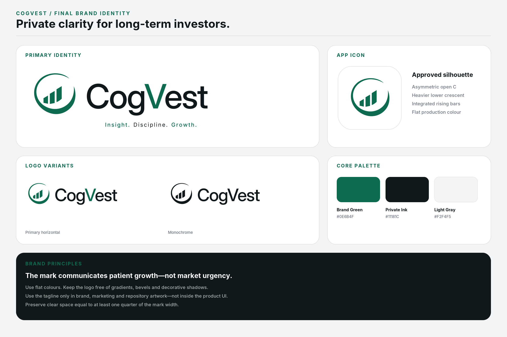

# CogVest Brand Assets

The approved identity source is CogVest Final Brand Package version 2.0. The
repository keeps only the runtime artwork and the brand board needed to prevent
implementation drift.

## Runtime Mapping

| Use | Repository asset | Requirements |
| --- | --- | --- |
| Legacy launcher icon | `assets/brand/icon.png` | 1024x1024, opaque, no pre-rounded mask |
| Adaptive foreground | `assets/brand/adaptive-icon-foreground.png` | 1024x1024, transparent mask-safe artwork |
| Android themed icon | `assets/brand/android-monochrome-icon.png` | 432x432 monochrome alpha layer |
| Splash mark | `assets/brand/splash-icon.png` | 1024x1024 transparent artwork on Private Ink |

Expo configuration uses a white adaptive-icon background and `#11181C` for the
splash background. Android applies the launcher shape and Android 13+ themed
icon colors. See the official Expo app-icon guidance:
https://docs.expo.dev/develop/user-interface/splash-screen-and-app-icon/

## Identity Rules

- Preserve the asymmetric open-C silhouette, heavier lower crescent, and three
  integrated rising bars.
- Use Brand Green `#0E6B4F` and Private Ink `#11181C` for identity artwork.
- Do not recolour the mark with semantic gain/loss colors.
- Do not add gradients, metallic effects, bevels, outlines, or shadows.
- Keep clear space equal to at least one quarter of the mark width.
- Use the tagline only for marketing and repository artwork, not product UI.
- Do not replace these files with generated variants without an approved brand
  revision and corresponding Android launcher-mask verification.

## Android Verification

The compiled SDK 54 resources were verified on the Android 16 emulator using a
fresh local x86_64 APK. The adaptive foreground's non-transparent bounds are
496x496 inside its 1024x1024 canvas, leaving ample launcher-mask safe space.

- [Launcher evidence](../testing/artifacts/brand/launcher-android16.png)
- [Splash evidence](../testing/artifacts/brand/splash-android16.png)
