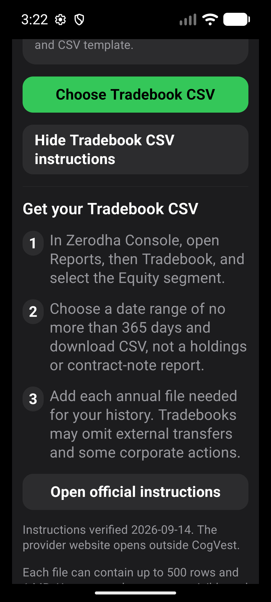
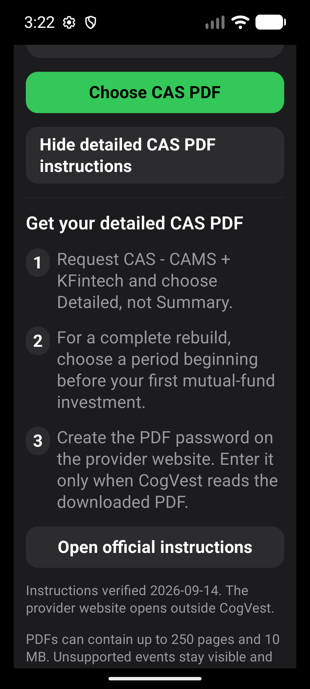
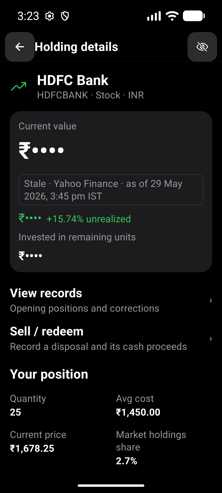
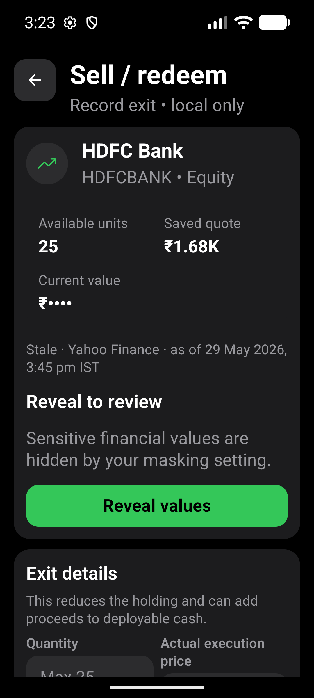
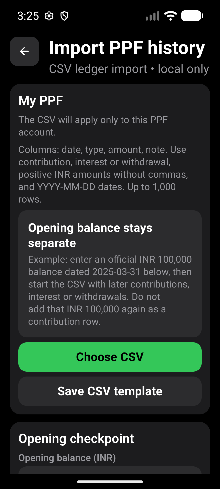
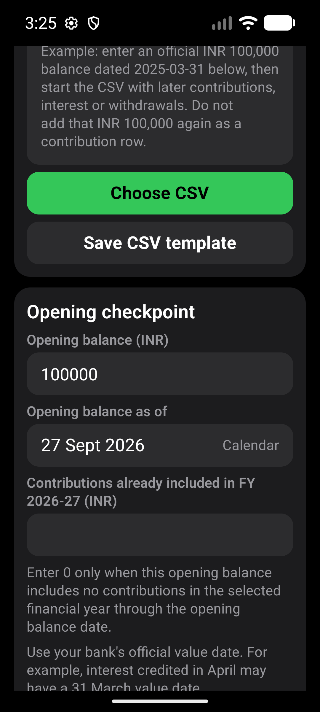

# Import guidance and secondary masking evidence

Related: #401. This is a bounded installed-app verification pass, not closure
of the UX tracker or a production behavior change.

## Build and environment

- Source baseline: `origin/main` at `3eef2d8` (merged #433).
- Fresh local APK built with `EXPO_OFFLINE=1 npm run android:apk:emulator`;
  Gradle succeeded in 18 seconds and `adb install -r` succeeded.
- APK: `android/app/build/outputs/apk/debug/app-debug.apk`.
- SHA256: `D383C9506E2FEC2CAB6A6A60EBA5D9098DADF61DED478932DE63544E13CE3F2A`.
- Debug native build with current JavaScript served by offline Metro. This is
  not a standalone release-bundle or cloud-preview APK verification.
- Pixel_10_Pro AVD, emulator-5554, Android 16/API 36, x86_64.
- Default: 1280x2856, 480 dpi, approximately 427dp wide, font scale 1.0.
- Narrow: 1080x2400, 480 dpi, 360dp wide, font scale 1.3.
- Only disposable synthetic emulator data was cleared or replaced; no private
  statements or phone data were used.

## Coverage and observations

`import-guidance-expanded.yaml` passed at both configurations. Six captures per
configuration show expanded Tradebook and CAS guidance, official-instructions
buttons, and transaction/opening-holdings CSV template entry points. Numbered
steps and buttons remain readable, with normal vertical scrolling at enlarged
text; there was no observed horizontal clipping in the captured content.

`secondary-masked-evidence.yaml` passed at both configurations. Six captures per
configuration show holding details, holding duration, conviction insight,
empty transaction history, saved opening-position correction, and Sell/Redeem.
Saved aggregate amounts remain hidden; correction and disposal screens require
deliberate reveal. Quantities, percentages and per-unit prices intentionally
remain visible under the approved #404 contract. This is aggregate-value
masking, not a guarantee that every portfolio attribute is private.

The narrow correction screenshot records the reveal gate and Back to Holdings
control at the retained scroll position, not the entire page header. Longer
insight and disposal pages extend below the captured viewport.

The existing `e2e/ppf-account.yaml` synthetic account journey and the new
`ppf-import-guidance.yaml` both passed at the narrow configuration. Two captures
show the separate opening-balance example and financial-year contribution
checkpoint. Labels, example and template controls wrap without horizontal
clipping. No PPF file was selected or imported. PPF guidance was not captured
at default size in this pass.

All 26 final screenshots were visually inspected and published. The runner
restored the emulator's default display size and font scale after completion.

## Harness corrections

The first matrix had four failed flows. Default guidance entered a deep link
before cold startup completed; the flow now waits for Dashboard. Narrow guidance
incorrectly assumed reopening import resets its source to CSV; it now selects
CSV explicitly. Both masking flows originally targeted a new draft review and
expected masking of draft amounts. That was the wrong target under #404: draft
entry remains usable. The corrected test targets an existing saved position
and Sell/Redeem, without weakening the saved-value privacy assertions.

These were test-assumption corrections, not demonstrated production defects.
Only final-run screenshots are published.

## Verification boundaries

- `npm run test:v1:pc` passed: 167 suites and 1767 tests; the existing one suite
  and three tests remained skipped. TypeScript, Expo Doctor (17/17), Android
  readiness and strict installed-package smoke checks also passed.
- Transaction history is empty for the seeded HDFC holding. Its capture does
  not prove masking of populated transaction rows.
- No provider website was opened or revalidated, and no CSV template save,
  document picker or file import was exercised in these guidance captures.
- Reveal/re-entry transitions, destructive edits, masked populated cash/PPF
  records and masked import previews are not exhaustively covered here.
- No actual spoken TalkBack, foldable/tablet, private-statement reimport or
  standalone release-mode verification is claimed. #401 remains open.

## Screenshot index

Artifacts are under `artifacts/2026-09-27-guidance-masking/`. For each `default`
and `narrow` prefix:

- `tradebook-top`, `tradebook-bottom`: expanded annual Tradebook instructions.
- `cas-top`, `cas-bottom`: detailed CAS and password guidance.
- `transaction-csv`, `holdings-csv`: versioned-template entry points.
- `masked-detail`, `masked-duration`, `masked-insight`: secondary privacy views.
- `masked-records`: empty transaction-history state only.
- `masked-review`, `masked-sale`: saved-value reveal gates.

Representative enlarged-text evidence:

