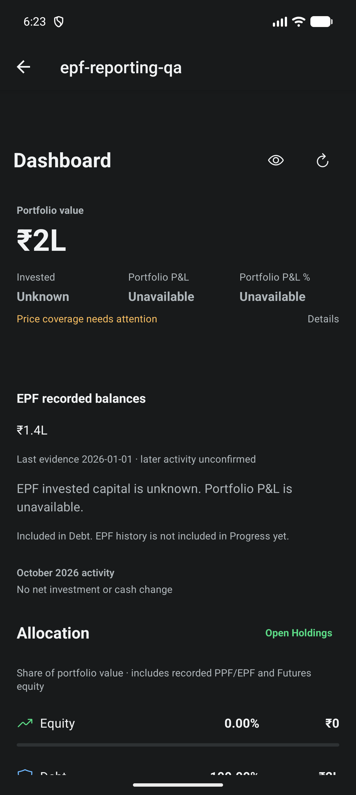
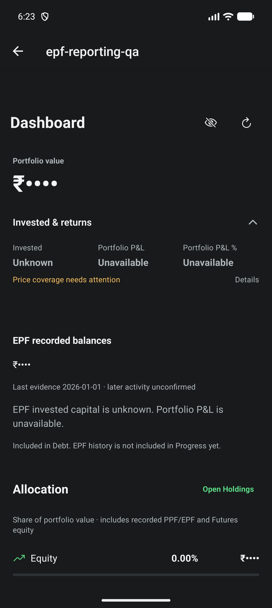
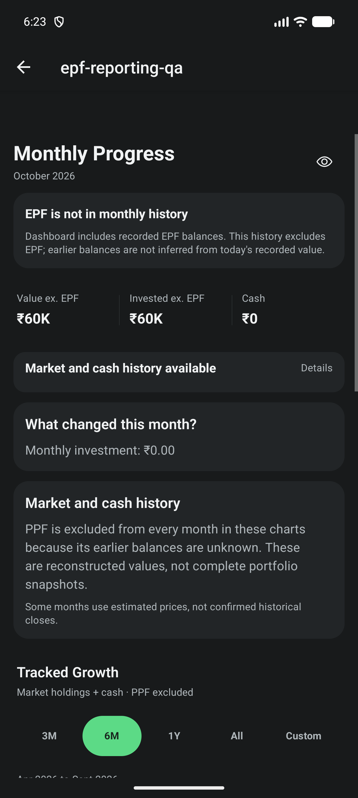

# EPF current reporting

Related to #545 and #542. This is the current-value slice, not completion of #545.
Stacked on persistence PR #550 and accounting PR #549.

## Implemented boundary

- Recorded EPF account balances and in-transit value enter Dashboard wealth once
  and join Debt allocation. EPF is not a quoted market holding.
- EPF 140000 + PPF 50000 + other Debt 10000 yields wealth and Debt of 200000,
  with a 100% Debt denominator in the synthetic fixture.
- Unknown EPF capital makes aggregate invested capital unknown and P&L unavailable.
  Quick Setup's portfolio summary follows the same rule. Checkpoint value is
  never used as a substitute for lifetime contributions.
- Evidence dates and incomplete later activity remain visible. Explicitly linked
  Cash movements are not labelled as unresolved destinations.
- Dashboard contribution activity includes employer/employee contributions not
  already linked to tracked Cash. Interest, reconciliation and EPF-to-EPF
  transfers are not contributions. Reversed contributions offset their reversal
  month's activity.
- No historical snapshot is changed by current reporting. Progress explicitly
  states that EPF is excluded; its fallback figures use EPF-excluded labels.
- Existing legacy holdings are not matched or deleted by name. Do not duplicate
  a legacy EPF-like holding into an EPF account before explicit linking ships.

## Native evidence

`npm run test:v1:pc` passed: TypeScript, 203 Jest suites / 2146 tests, repository
doctor, Android doctor and strict smoke. One suite / three tests remain skipped.
The new Progress notice test initially left history automation running across
tests; gating automation for that notice-only test fixed the full-suite failure.
`npm run maestro:test -- e2e/epf-reporting.yaml` passed after final corrections.

Fresh local debug APK built and installed with `adb install -r`, no data reset.
Package `com.abdulshaikh.cogvest`, version 1.0.24 (25). AVD `CogVest_UX_Proof`,
API 36, 1280x2856, 480 dpi, font scale 1.0. This is a development client using
the branch's JavaScript from Metro, not a signed release test.

Native shell APK SHA-256:
`CB8ECDA062ACFB95A0DDFC9D07AE705E1037CF48829FDD18558646F3D60C48BC`.
The shell hash matches the previous debug build because JavaScript is served by
Metro. It does not identify the tested JavaScript revision.

`e2e/epf-reporting.yaml` uses a development-token-gated memory-only fixture.
It asserts exact 200000 and 140000 accessibility values, 100% Debt, unknown
invested capital, Minimal Mode disclosure, masking and the Progress scope notice.
No default portfolio data is seeded or cleared.

Screenshots reviewed for readability and clipping in the tested configuration.
The initial disclosure tap failed; using its accessible text target with a
no-change retry passed without changing production disclosure behavior.

## Still required under #545

- Evidenced EPF month-end values, unknown historical capital, partial coverage and
  transfer/reconciliation attribution in snapshots without erasing market history.
- Explicit legacy-holding links with effective baselines and validated persistence.
- Complete account discovery, settings/insight scope audit and XIRR input alignment.
- Remaining history mutation, delayed-interest and corrected-snapshot tests.

#546 manual account UI and #547 final end-user/release evidence also remain open.
No merge, tag, cloud build or release was performed. #529 remains separate.
