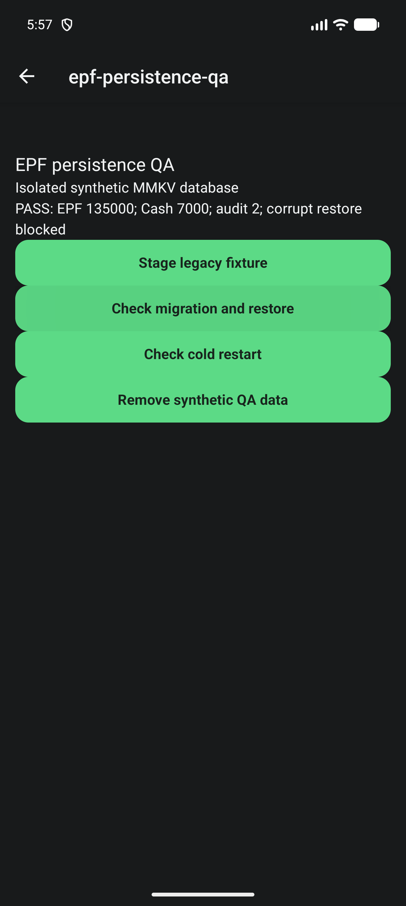
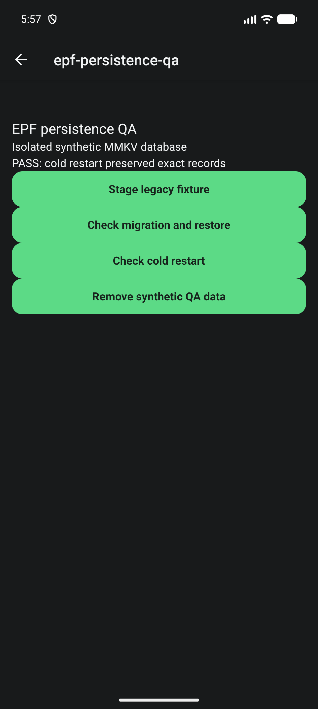
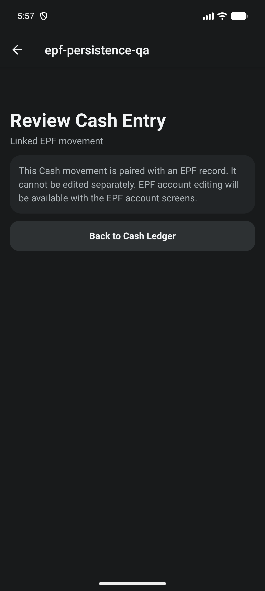

# EPF persistence verification

Issue #544; stacked on #543 / PR #549. Related to tracker #542.

## Boundary

Portfolio schema 16 persists EPF accounts, events, explicit Cash links and edit
history. Older supported stores and backups gain empty EPF collections; existing
market, Cash, PPF and Futures records are preserved. Backup envelope version stays
1; its nested portfolio version is 16. Older apps cannot read schema 16.

Commands use an expected portfolio revision and stable idempotency key. Candidate
records, limits and links are validated before one portfolio write. Paired Cash
changes are not independently editable. Account deletion exposes dependencies
and never cascades into another account. Audit records preserve prior values;
they are not a cryptographic tamper-proof log.

Cash links require an explicit, settled, same-day INR employee contribution or
withdrawal. Employer contributions never spend tracked Cash. The ledger keeps
withdrawal destination unknown; a validated persisted Cash link supplies the
tracked-Cash evidence. No salary, UAN, credentials or statement files are stored.

EPF totals and account screens are not enabled by this slice. Until #545,
historical Progress excludes EPF and treats linked Cash movements as crossing
that report's boundary. Whole-portfolio transfers will need the broader EPF
reporting integration, not a second inferred contribution.

## Fresh native proof

- Fresh local debug APK, package `com.abdulshaikh.cogvest`, version 1.0.24 (25).
- APK SHA-256: `CB8ECDA062ACFB95A0DDFC9D07AE705E1037CF48829FDD18558646F3D60C48BC`.
- AVD `CogVest_UX_Proof`, emulator-5554, API 36, 1280x2856, 480 dpi, font scale 1.0.
- Installed using `adb install -r`; no uninstall or default portfolio reset.
- `npm run maestro:test -- e2e/epf-persistence.yaml`: passed.
- Native MMKV proof uses the isolated `cogvest-epf-persistence-qa` namespace,
  gated behind development mode and the local visual-QA token. Cleanup passed.
- V15 fixture migrated on cold startup. An unknown-basis EPF opening of 140000
  and linked withdrawal of 5000 yielded EPF 135000 and Cash 7000 (2000 opening).
- Export, removal, restore and another cold restart preserved exact serialized
  records, one link and two audit entries. Corrupt Cash amount restore left the
  original bytes unchanged. Assertions inspect state, not just success text.
- Protected Cash review exposed no independent save action. Screenshot reviewed:
  readable copy and unobstructed return action in the tested configuration.

## Coverage and remaining work

`npm run test:v1:pc` passed: TypeScript, 200 Jest suites / 2135 tests, Android
doctor and strict installed-package smoke. One suite / three tests remain skipped
by the existing configuration. Initial harness failures (native-module Jest mock
and Maestro flow registration) were corrected before this final run.

Automated tests cover populated old-store/old-backup migration, snapshot-only and
complete-history records, cross-account transfer round trips, unknown capital,
duplicate/stale commands, Cash insufficiency, correction/deletion dependencies,
write failure, invalid restore and recovery quarantine/reset. The native proof
does not claim a signed release or end-user EPF account journey.

#545 reporting, #546 manual account UI and #547 final release/accounting evidence
remain open. #529 remains separate. No cloud build, tag, release or merge was run.
