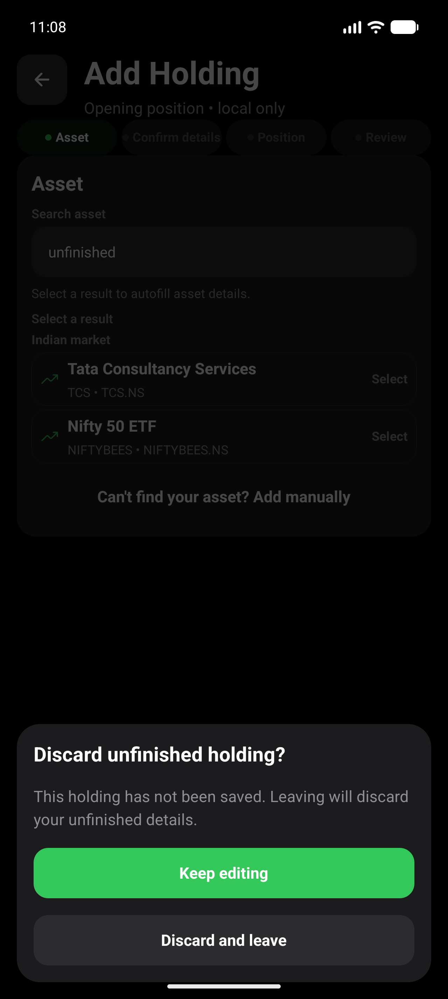

# Add Holding Back Verification

Issue: #267. Date: 2026-09-05. Scope: UX-01 navigation and unfinished input.

## Environment

- Pixel 10 Pro, `emulator-5554`, default font scale.
- `npm run android:apk:emulator`: local debug build succeeded; installed using
  `adb install -r android/app/build/outputs/apk/debug/app-debug.apk`.
- Current branch JavaScript served through Metro. Debug APK requires Metro;
  this is not a standalone release-performance test or an EAS build.
- Synthetic emulator data reset was explicitly approved by the user.
- Lookup uses the existing deterministic development provider fixture.

## Results

- `npm run test:v1:pc`: typecheck, 96 suites / 952 tests, Expo doctor 17/17,
  Android readiness and strict installed-package smoke passed.
- `npm run maestro:test -- e2e/add-holding-back.yaml`: passed.
- Android Back moved Review to Position; quantity `2` and average cost `1500`
  remained. Toolbar Back moved to Confirm details, footer Back moved to Asset.
- Android dismissal and Keep editing both retained the draft. Returning to
  Position preserved the original quantity and cost.
- Save created exactly one opening position: invested INR 3,000, current
  INR 3,356.50, quantity 2. Back after save returned to Dashboard.
- Explicitly discarding another unfinished entry left the record count at one.
- Component tests additionally cover all three Back entry points through every
  phase, notes retention, saving lock, inactive-route cleanup, pristine exit and
  navigation fallback. Existing rapid-setup tests remain green.
- Independent owned-diff review found no concrete navigation regression.

## Visual Evidence

The confirmation names the unfinished holding, explains data loss, and offers
Keep editing before Discard and leave. Original emulator captures:

Retained input was asserted by Maestro. Its extra screenshot contains the
emulator's floating IME toolbar and is excluded from accepted visual evidence.
The panel reuses existing shared button styles; the audit's shared color-contrast
finding remains separate work, not a claim resolved by this navigation fix.

The feature guards deliberate navigation; it does not persist drafts across
process death. Chart UX findings remain separate work.
