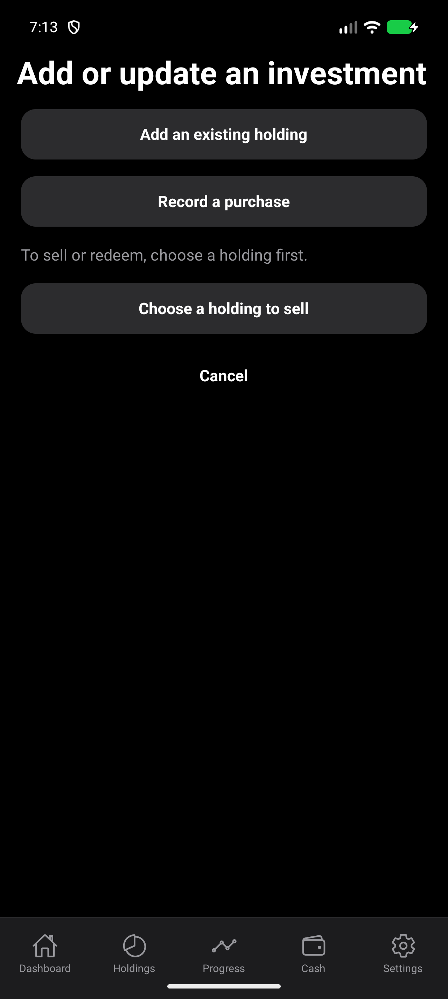
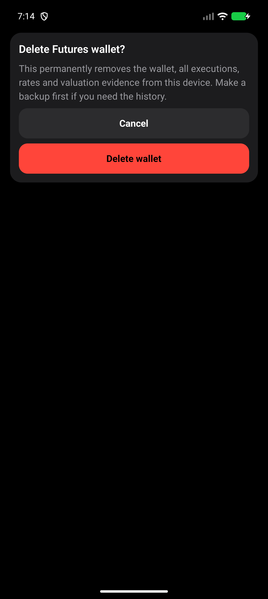
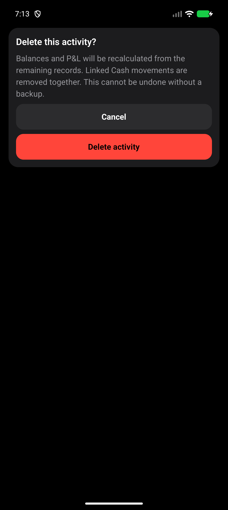
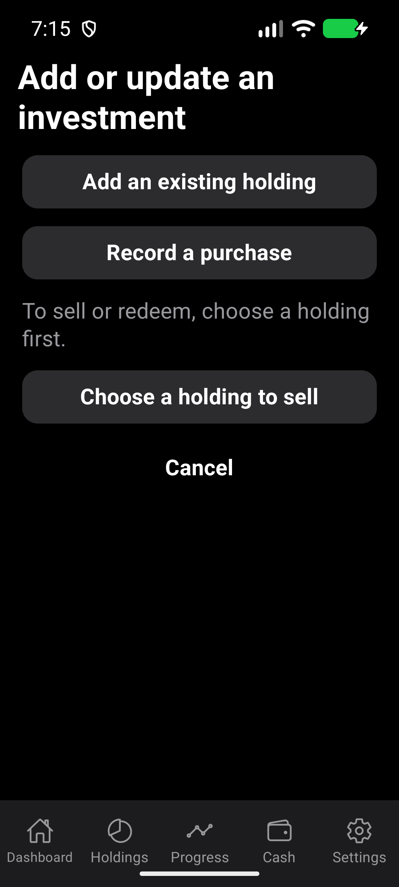
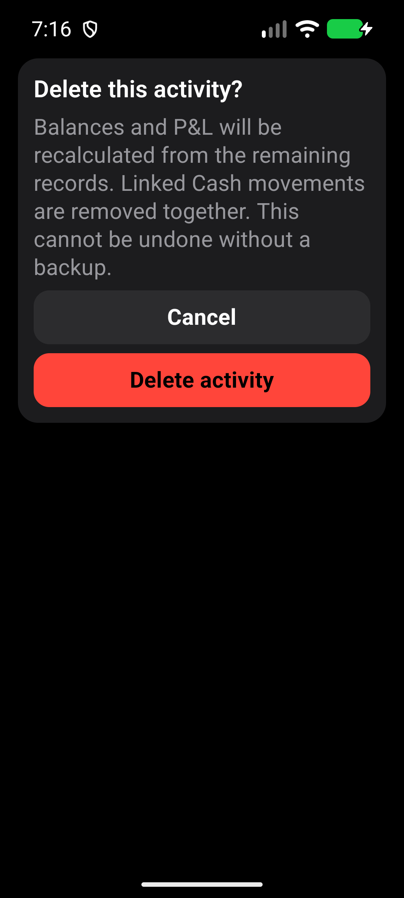

# Legacy entry and Futures confirmations

Issues #500 and #501. Checked 2 October 2026 against changes based on
`6057f6c`, release version 1.0.14 / versionCode 15.

## Changes

The hidden `/add-trade` route now requires an explicit choice between adding an
existing holding, recording a purchase, and choosing a holding to sell. Obsolete
link parameters are not forwarded into a different financial workflow. Choosing
an action replaces the compatibility route; cancel returns to Holdings.

Futures wallet and activity deletion use the existing dark card and semantic
destructive button components in a scrollable, safe-area-aware modal. Android
Back and Cancel dismiss it without writing records. Outside taps do not dismiss
the full-screen confirmation. A synchronous guard prevents repeated confirmation
callbacks. Store deletion eligibility, linked Cash operations and calculations
are unchanged.

## Build and environment

- Fresh locally built release-mode x86_64 APK, installed with `adb install -r`.
- APK SHA256: `D10F03DB1E8A3A4E677ADAFA88B947D83DFA4C7897049ED53163F3B178ED3A30`.
- Local debug signing identity for emulator testing only. Not for distribution.
- CogVest_UX_Proof AVD, Android API 36, density 480, software renderer.
- Normal: 1280x2856, font scale 1.0. Large: 1080x2400, font scale 1.3.
- Synthetic portfolio, Standard display mode, masking off. No private statement.
- No cloud build, release, or physical-phone test.

## Automated checks

`npm run test:v1:pc` passed, including TypeScript, 189 test suites, 1,971 tests,
17/17 Expo checks, Android doctor and strict installed-package smoke. Three tests
in one suite remain skipped; they are not counted as verified.

Focused tests cover the legacy choices, no automatic redirect or raw form,
wallet cancellation and Android dismissal, repeated confirmation, preservation
of unrelated drafts, linked-Cash cancellation, the wallet deletion guard, and
removal of both linked transfer legs.

The fresh APK was installed after the full check command; the native journeys
below verify the changed release bundle rather than relying on the earlier smoke
check of the installed package.

## Native journeys

The normal entry/confirmation flow passed. The large-text pass completed in two
parts after a Maestro transport failure and emulator stall. Restarting the same
AVD without wiping data restored responsiveness; the resumed flow verified the
persisted 1,000 USDT balance and completed wallet Back/cancel/delete and cleanup.
All six normal/large screenshots were inspected. No clipped warning, truncated
action, or unreachable button was observed. This is not a performance result.

The linked-Cash flow also passed on the fresh APK at normal size. Wallet deletion
was rejected with the linked transfer intact; cancelling activity deletion kept
INR 41,000, and confirming it restored INR 50,000. The temporary wallet was then
removed. Display/font settings and temporary handwriting overrides were restored
after the runs. Existing portfolio records were not cleared.

- `e2e/visual/audit-entry-confirmations.yaml` checks warm and cold old links with
  obsolete sell parameters, explicit purchase handoff, cancellation, wallet and
  activity Back/cancel/confirm, and actual values. Funding changes wallet equity
  from 1,000 to 1,002 USDT; cancellation preserves 1,002, and confirmed deletion
  returns it to 1,000. Wallet cleanup leaves no Futures wallet, no new holding
  transactions, and the original INR 50,000 Cash.
- `e2e/visual/audit-futures-linked-delete.yaml` checks a temporary INR 9,000 /
  100 USDT transfer against existing synthetic Cash. It asserts INR 41,000 after
  funding, after rejected whole-wallet deletion, and after activity cancellation;
  confirmed transfer deletion restores INR 50,000 before wallet cleanup.

## Visual evidence

## Scope limits

No TalkBack claim, performance claim, or exhaustive financial/provider state
matrix. The original all-screen audit remains a historical record; this evidence
addresses its two findings only. The old unreferenced form source is retained to
avoid unrelated cleanup; it is no longer rendered by the shipped route.
