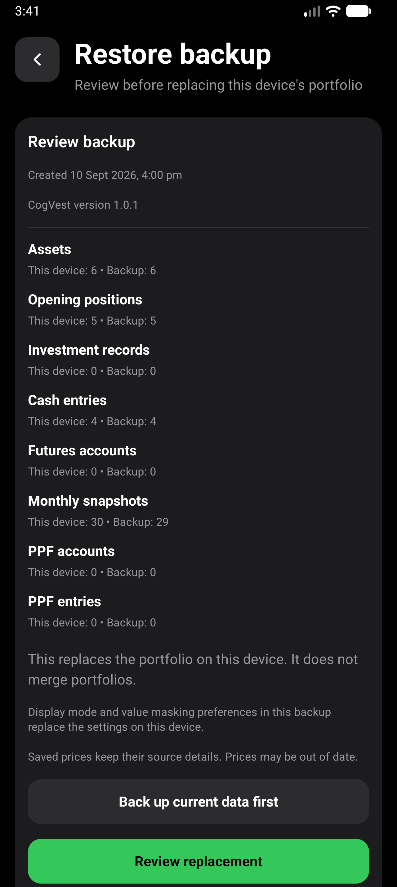
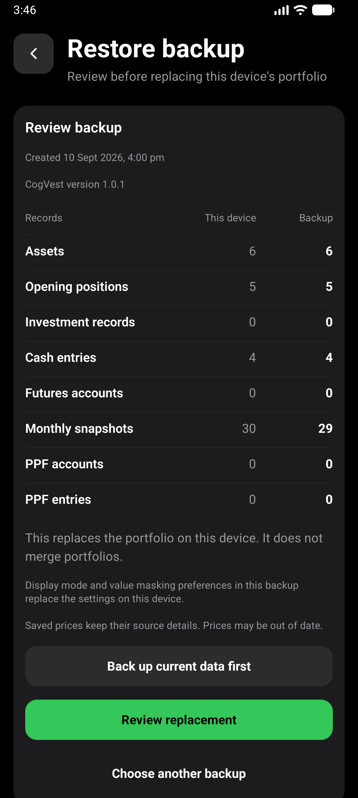
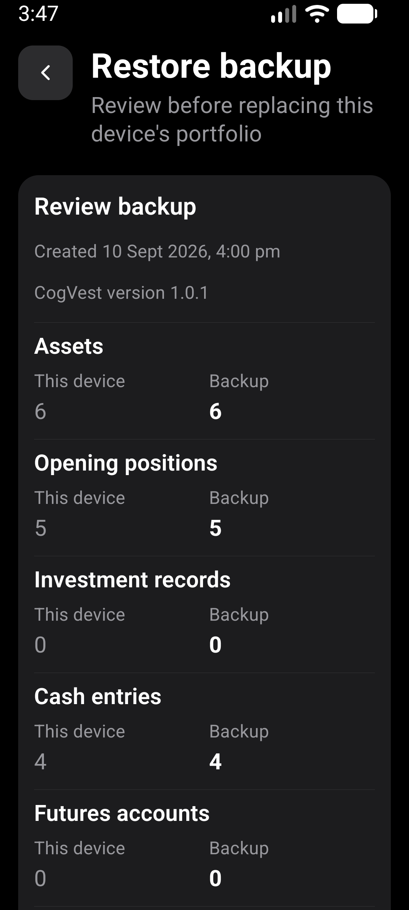
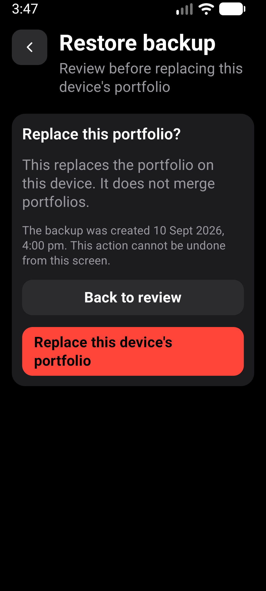

# Backup review comparison

Verified 2026-10-02, based on main `5013170` after merging PR #477.

## Change

Replace repeated count sentences with aligned Records / This device / Backup
columns. Backup counts have stronger emphasis without gain/loss colors. At
larger font sizes or widths below 360 points, each record gets labeled value
pairs. Zero counts stay visible. Accessible row labels contain the category
and both counts, independently of the column headings.

File selection, backup export, restore, busy handling, Back behavior and the
separate destructive confirmation are unchanged. No warnings were removed.

## Verification

- `npm run test:v1:pc`: 186 suites / 1,917 tests passed; one suite / three
  tests skipped. All 17 Expo checks, Android doctor and strict smoke passed.
- Screen tests assert unequal counts, zero counts, large text, long category
  names, warning copy, non-mutating selection, confirmation and Back behavior.
- Fresh local x86_64 release APK installed over the existing synthetic data.
- AVD: CogVest_Perf, emulator-5554, API 36, density 480.
- Normal: 1280x2856, font scale 1.0. Large text: 1080x2400, font scale 1.3.
- `e2e/visual/backup-review-layout.yaml` selects the existing synthetic QA
  export `cogvest-synthetic-design.json` from Downloads. It checks record
  counts, opens the confirmation and backs out twice. It never presses the
  replacement button or clears app data.
- Both native runs passed. The large-text run asserted 30 device snapshots
  against 29 in the file after the earlier preview was cancelled. Screenshot
  inspection found readable values and no overlapping labels. Display settings
  were restored after testing.
- No physical-phone or TalkBack verification is claimed. Full restore was
  not repeated on the emulator for this presentation-only change.

APK SHA-256:
`06065D21CD9E4FE1DDC56566DE27AA296D0E8395F77788BDF750BD4E8DE0F02F`.

## Screenshots

