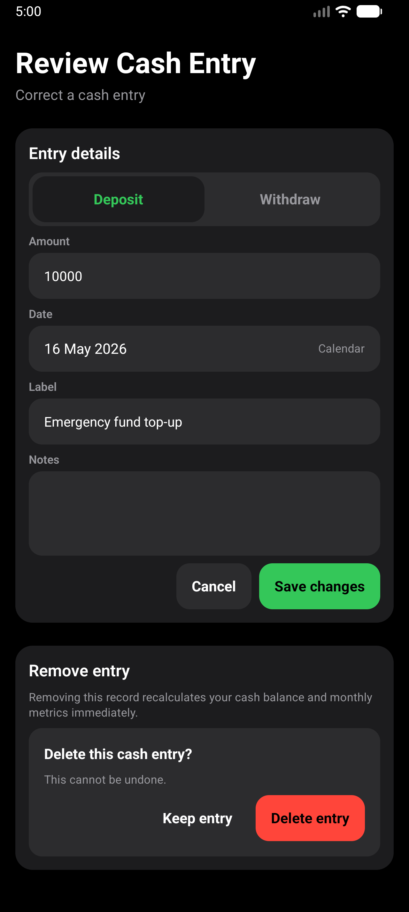
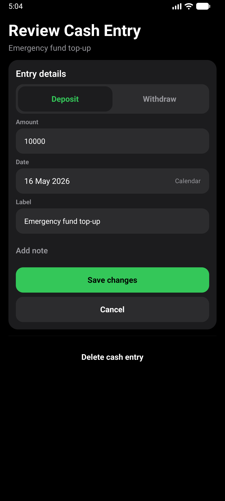
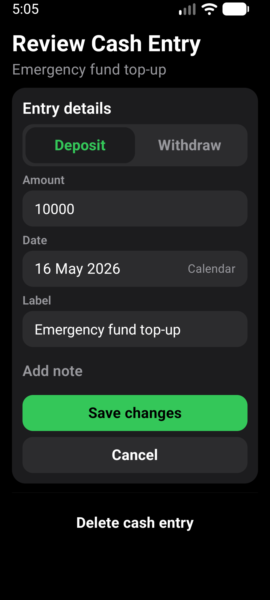
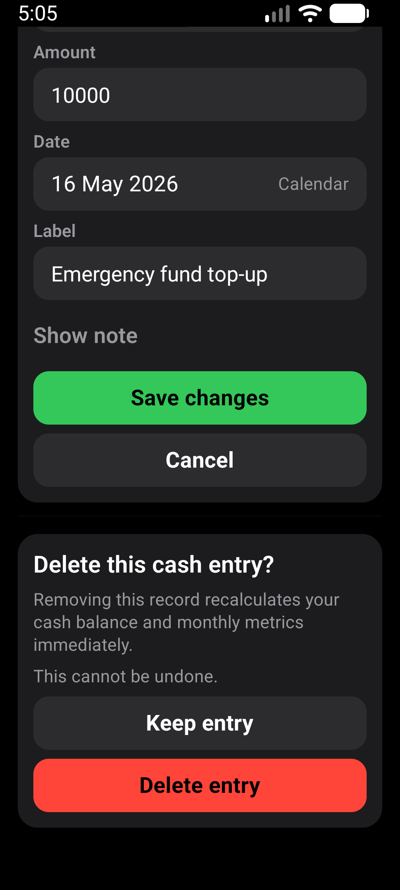

# Cash correction layout

Verified 2026-10-02, based on main `717644d` after PR #480.

## Scope

Manual Cash correction shows the saved entry label as context. Existing notes
start expanded; empty notes use Add note. Collapsing the editor retains its text.
Save and Cancel use full-width actions. Deletion stays below a divider, with its
impact and irreversible warning shown in one confirmation rather than nested cards.

Cash calculations, persistence, validation, masking gates, linked-record owner
routes and delete confirmation behavior are unchanged.

## Verification

- `npm run test:v1:pc`: 186 suites / 1,919 tests passed; one suite / three tests
  skipped. All 17 Expo checks, Android doctor and strict smoke passed.
- Focused correction screen: 14 tests passed, including hidden-note persistence,
  unsaved-note cancellation, linked-record restrictions, masking, delete
  confirmation and failed-save recovery.
- Fresh locally signed x86_64 release APK installed without clearing data.
- AVD: CogVest_Perf, emulator-5554, API 36, density 480.
- Normal display: 1280x2856, font scale 1.0.
- Larger text: 1080x2400, font scale 1.3.
- Maestro: `e2e/visual/cash-correction-layout.yaml`. Existing synthetic
  INR 10,000 entry. Expand a note, enter a draft, hide/reopen and assert the
  draft survives. Open deletion, choose Keep entry, leave without saving and
  reopen the unchanged amount. The larger-text run also asserts Add note after
  reopening, confirming the draft was not saved.
- Both native runs passed. The before capture predates the note-disclosure steps.
- Inspected form and confirmation screenshots at both sizes. No overlapping
  labels or actions; the impact warning and both confirmation actions remain
  reachable at larger text sizes.
- No records saved or deleted. Display/font settings restored; Gboard stylus
  handwriting temporarily disabled, then restored to its prior unset state.
- No physical-phone or TalkBack verification claimed. Masking and linked-owner
  restrictions were checked by component tests, not separate native runs.

APK SHA-256:
`452876F8CCBA987AE60B6C4786FDBCF775612B1FE21A35B9A83A82BE18F92437`.

## Evidence

