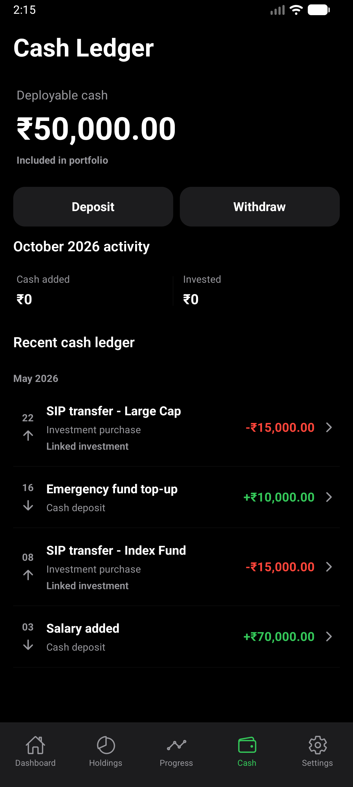
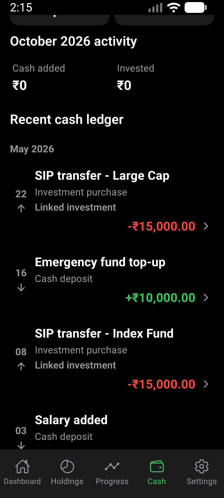
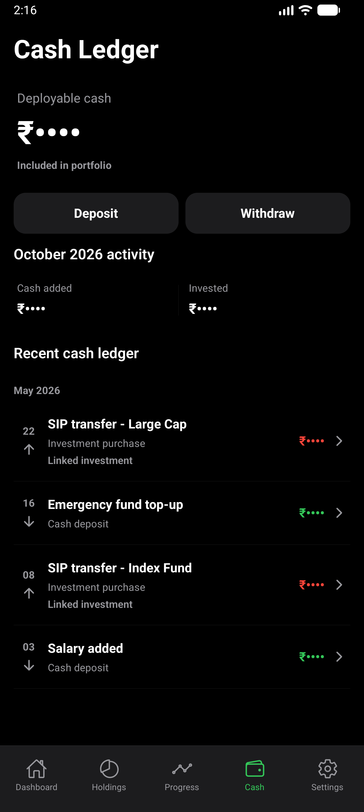

# Cash screen hierarchy verification

Verified 2026-10-02 with the synthetic visual-QA portfolio on a freshly built,
installed standalone release APK.

## Scope

Cash now groups the balance with its actions and keeps monthly activity in a
single section. Ledger rows group by calendar month and use a day/direction
column, short movement labels and signed amounts. Original labels, notes,
linked-entry review routes, calculations and record-writing behavior remain.

## Environment

- AVD CogVest_Perf, API 36, x86_64, density 480.
- Normal display: 1280x2856, font scale 1.0.
- Narrow/enlarged: 1080x2400, font scale 1.3, logical width 360dp.
- Local release APK, private emulator QA signer, no Metro.
- Final APK SHA-256: `AC63AE03314217E32F19167E9D4BE8656016631D57B5A202711B4DE597A1EB47`.
- Existing synthetic portfolio only; no personal statements used.

## Verification

`npm run test:v1:pc` passed with 185 suites and 1,909 tests. The existing one
suite/three tests remain skipped. Expo Doctor passed 17/17, followed by Android
doctor and the strict installed-package smoke check. Typecheck and all 22 Cash
screen tests passed again after the final month-formatting correction.

The Maestro flow `e2e/visual/cash-hierarchy.yaml` checks the INR 50,000 balance,
the INR 10,000 entry in its review form, deposit draft cancellation/resumption,
explicit draft discard when switching to Withdraw, and amount masking. It
does not save any records. Both display configurations were exercised.

Screenshots were inspected for alignment, readable signed amounts, month/date
grouping, entry navigation and masking. Enlarged text puts amounts below the
entry details without overlapping them. A scrolled capture shows complete
rows below the initial viewport. Display size and font scale were restored.

## Screenshots

No physical-phone or TalkBack pass was performed. This is a Cash screen pass,
not completion of the remaining Settings, entry and import screen work.
