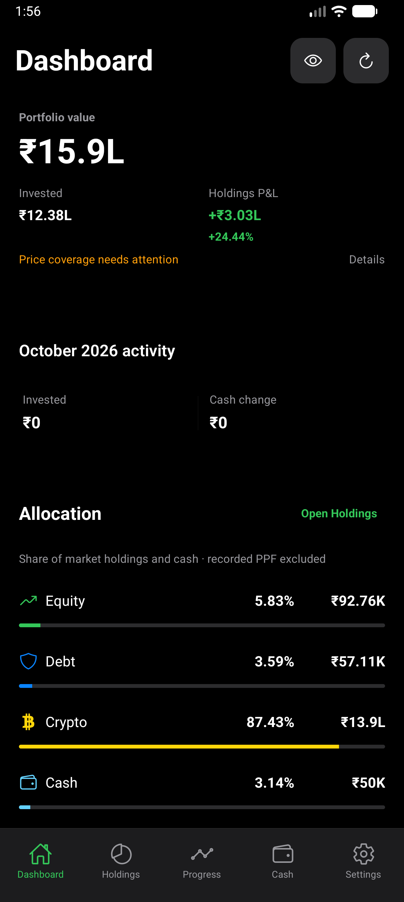
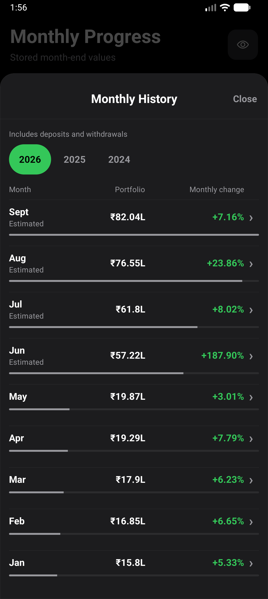
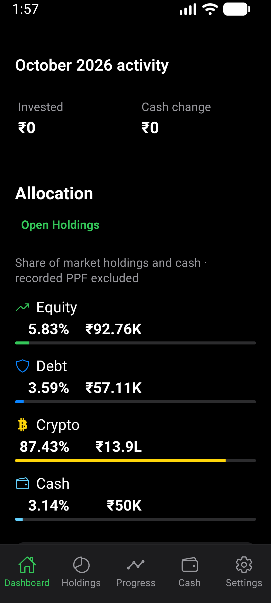
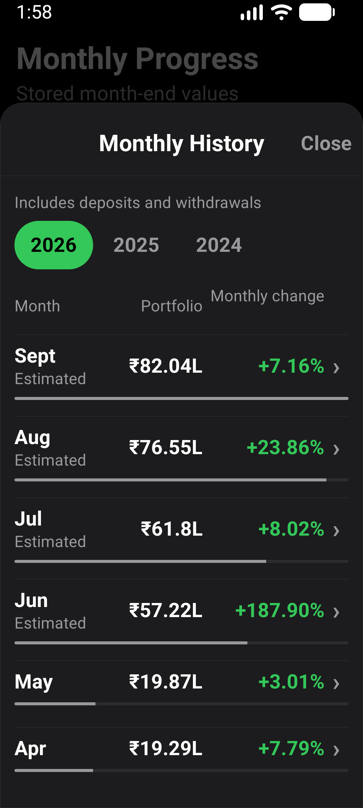
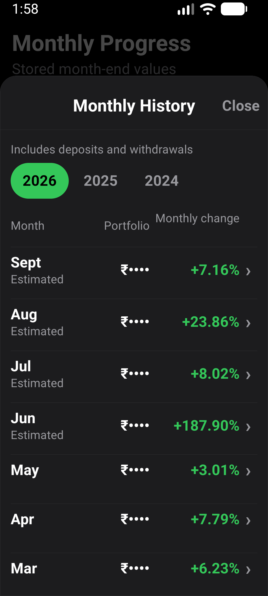

# Dashboard and monthly history verification

Verified 2026-10-02 on a freshly built and installed standalone local release
APK. This is the first deeper screen-enhancement slice, not an app-wide
completion claim.

## Changes checked

- Dashboard groups P&L amount and percentage under one label.
- Allocation rows pair their percentage and INR value with a proportional track.
  Signed negative-cash exposure retains its numeric presentation without tracks.
- Monthly History uses neutral portfolio-value bars, scaled within the selected
  year. Bars are absent when masked, when that year contains a negative value,
  or when all its values are zero. Monthly-change calculations are unchanged.
- Existing charts, month details, asset names, routes and stored records are
  unchanged.

## Environment and data

- AVD: CogVest_Perf, API 36, x86_64, density 480.
- Normal: 1280x2856, font scale 1.0.
- Narrow/enlarged: 1080x2400, font scale 1.3, 360dp logical width.
- Local release build with the existing private emulator QA signer; no Metro.
- APK SHA-256: `D7A3E8399AB8CC63C7DCF24778A4FE3D7026A01A82B2F29014E93B555DD6A14D`.
- Existing synthetic visual-QA portfolio restored through the real backup UI.
  No user statements or personal portfolio data were used for these captures.
- Emulator size and font settings restored after verification.

## Results

`npm run test:v1:pc` passed: 185 suites and 1,908 tests passed, with the existing
one suite/three tests skipped. Expo Doctor passed 17/17; Android doctor and
strict installed-package smoke checks passed. The 54 focused Dashboard/history
tests also passed after final source formatting.

`e2e/visual/dashboard-history-enhancement.yaml` passed at both configurations.
It checks the April 2026 value of INR 1,929,450.00 and +7.79% portfolio value
change, history/detail/back navigation, and absence of visible INR amounts after
masking. Component tests cover per-year bar scaling, zero values, masking,
negative years and cross-year percentage comparisons.

Screenshots were visually inspected for value alignment, track proportions,
label wrapping, visible controls and masking. Enlarged text stacks Dashboard
allocation labels above the numbers without overlap. History retains its
aligned values and percentages. Masked history has no value bars.

An initial restore run opened its deep link before startup settled. An initial
enlarged-text run tried the mask control while Dashboard was still scrolled
down. Both automation timing/navigation problems were corrected and rerun.

## Evidence

No physical-phone or TalkBack pass was performed. This slice makes no new chart
smoothness, financial-calculation or app-wide redesign claim.
