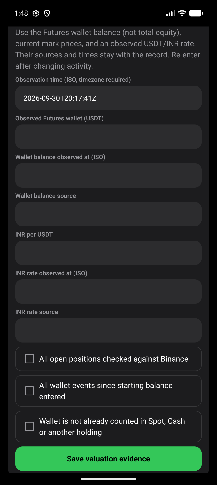
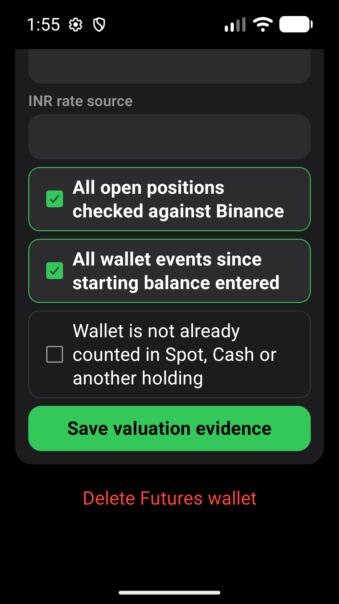
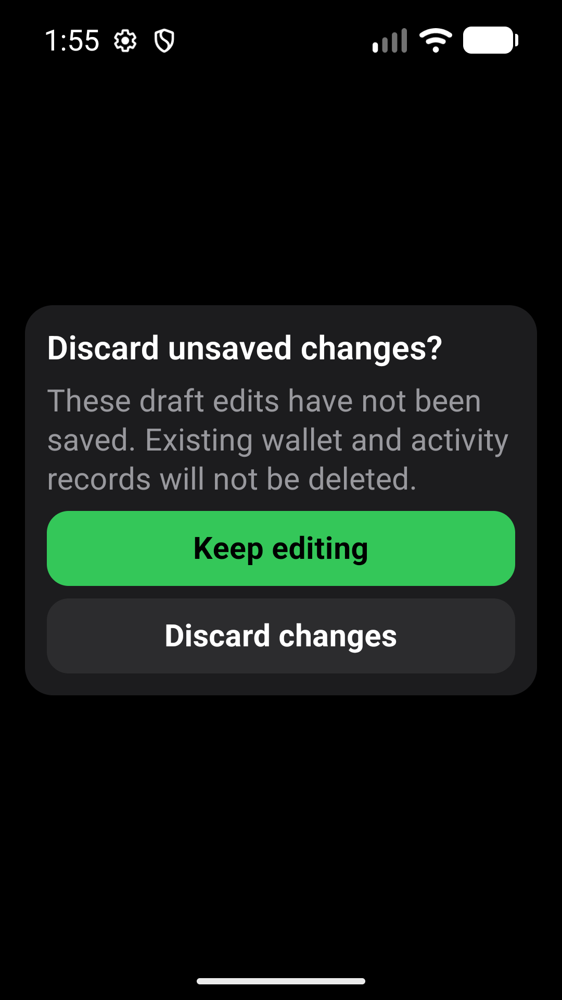
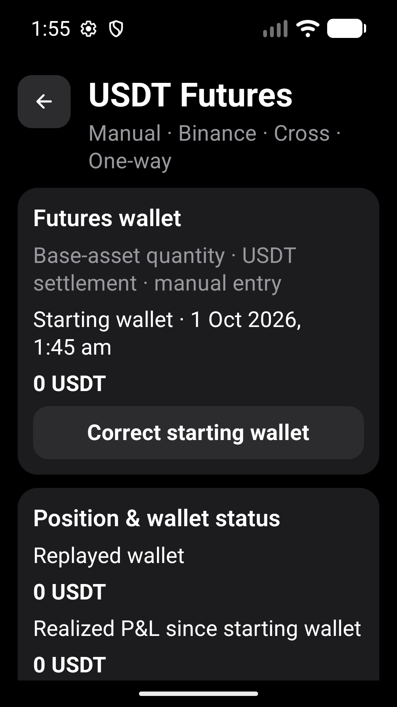

# Futures Draft And Control Evidence

Audit issues #449 and #451. Verified 2026-10-01 using synthetic records only.

## Environment

- Fresh local x86_64 debug APK, built with `npm run android:apk:emulator` and
  installed with `adb install -r`; current task JavaScript served by local Metro.
- Pixel_10_Pro, emulator-5554, Android API 36.
- Default display: 1280 x 2856, density 480, font scale 1.0.
- Narrow enlarged-text check: 1080 x 1920 (360 dp), density 480, font scale 1.3.
  Restarted the app after the configuration change to refresh native text measurement.
- Display/font settings restored. Original emulator MMKV preserved privately and
  restored byte-for-byte after testing; private archives are not committed.

## Results

`e2e/futures-draft-protection.yaml` passes on the fresh APK. For wallet,
execution, Cash funding and valuation drafts, visible Back and Android Back
offer Keep editing / Discard changes. Keep editing retains entered values;
explicit discard exits without saving them. After restart the only saved wallet
has 0 USDT, no execution was added, and the discarded valuation is absent.
Untouched and committed wallet forms do not prompt.

UI tests additionally cover original navigation-action replay, independent
confirmation states, local cancellation, saved valuation/funding cleanup, and
retention of a new draft when a different persisted activity is deleted.
No financial calculation, persistence schema or automatic save was introduced.

Native XML at density 3 reports:

| Control | Bounds | Effective Size / State |
| --- | --- | --- |
| Back, narrow | `[48,204][192,348]` | 48 x 48 dp |
| Positions checkbox, enlarged | `[90,531][990,735]` | 300 x 68 dp; checked |
| Events checkbox, enlarged | `[90,759][990,963]` | 300 x 68 dp; checked |
| Boundary checkbox, enlarged | `[90,987][990,1266]` | 300 x 93 dp; unchecked |

Confirmations expose `android.widget.CheckBox`, explicit labels, checkable and
independent checked state. Mutually exclusive event/side/direction choices remain
radios, with a minimum 48 dp height. Consent wording and wealth masking remain.

The narrow inspection used ADB gestures at the actual resized viewport after
Maestro scrolling retained old display coordinates. This is not a claim that a
complete narrow-profile Maestro suite passed. Screenshots show all confirmation
text, independent selection and both usable discard actions without clipping.

## Visual Evidence

## Limits

Native accessibility metadata and modal actions were inspected; spoken TalkBack
traversal and screen-reader focus restoration were not tested. This is local
development-APK evidence, not a physical-phone or standalone preview-release test.
