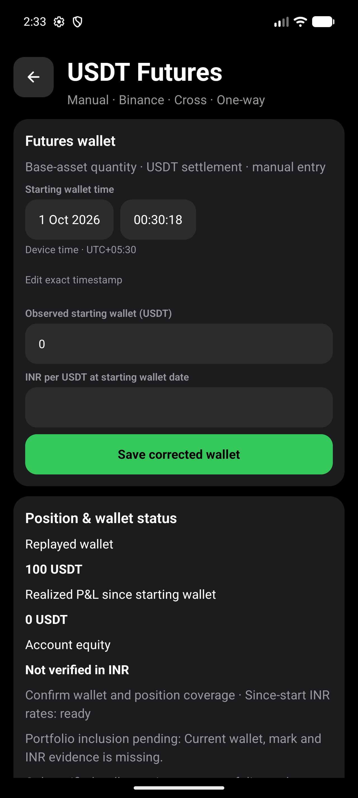
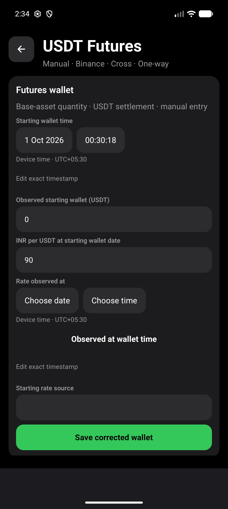
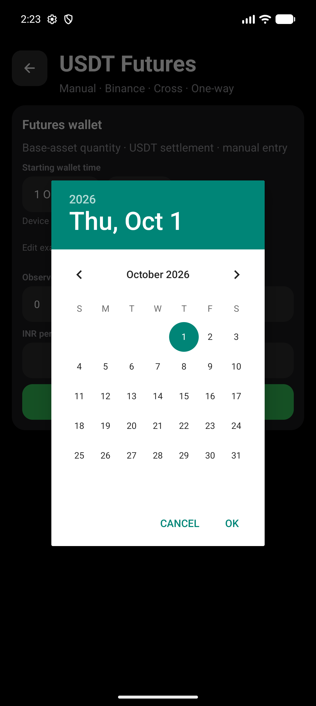
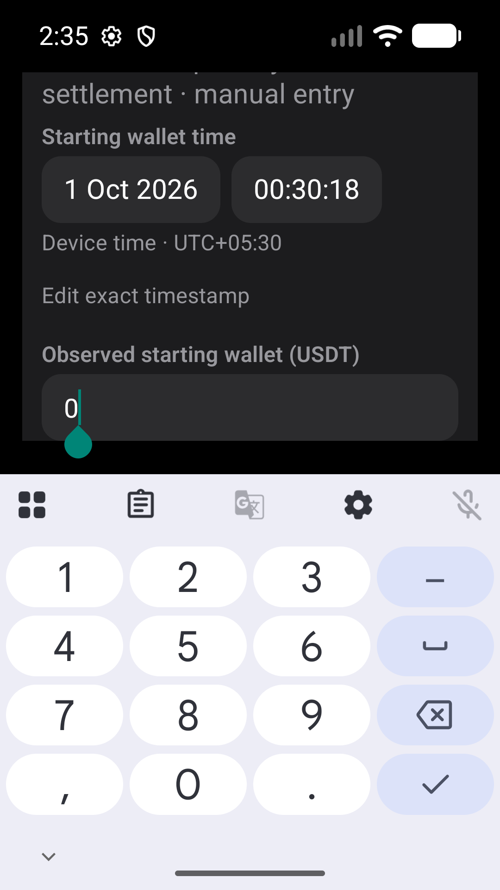
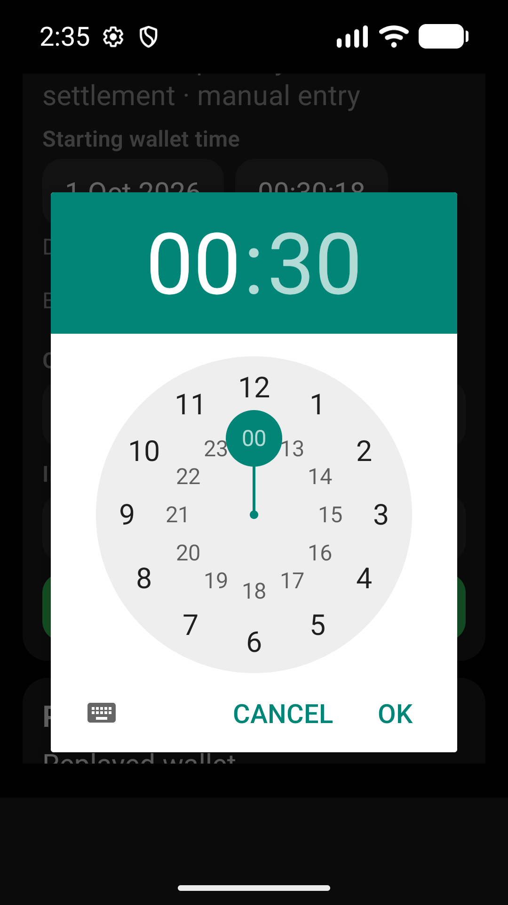
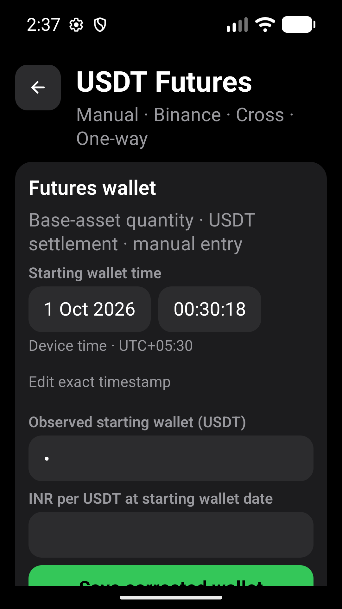
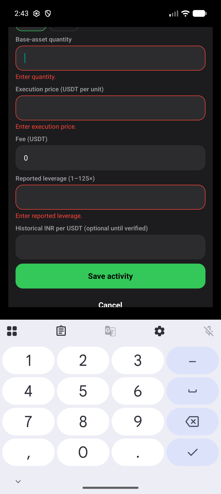
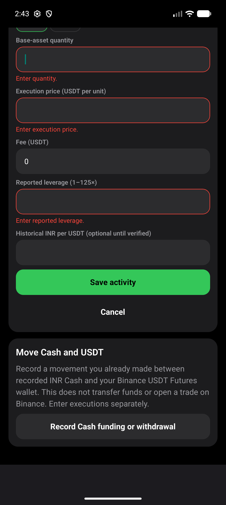

# Futures Timestamp Entry Evidence

Audit issue #450. Verified 2026-10-01 with synthetic records only.

## Environment

- Fresh local x86_64 debug APK built with `npm run android:apk:emulator`,
  installed with `adb install -r`, with current task JavaScript served by Metro.
- Pixel_10_Pro, emulator-5554, Android API 36.
- Default: 1280 x 2856, density 480, font scale 1.0.
- Narrow: 1080 x 1920 (360 dp), density 480, font scale 1.3. App restarted
  after configuration changes to refresh native text measurement.
- Narrow inspection used ADB at observed native bounds, not a claim that a
  complete Maestro suite passed under the resized profile.

## Behavior And Assertions

Date/time buttons open native calendar/clock dialogs. Device UTC offset is
explicit. Existing offset-bearing timestamps remain unchanged until the user
edits them; picker edits preserve seconds and fractional precision. Exact entry
remains available for historical evidence and pasted ISO timestamps.

Rate evidence stays absent until supplied. Reusing wallet/activity/valuation
time is an explicit action, not an inferred source or observed price. Historical
rate time/source fields are shown only when their optional rate is entered.
Required-field and timestamp errors appear beside their fields; native invalid
execution and valuation attempts do not save records. Financial validation
remains authoritative in the existing domain/store, including reconciliation,
historical conversion and one-way cross-margin USDT accounting.

`e2e/futures-timestamp-evidence.yaml` checks a historical September wallet and
execution, invalid blank execution/valuation, explicit observation-time reuse,
all three confirmations, and saved data after restart. A 1000 USDT wallet,
1 USDT execution fee and 10 USDT unrealized gain produce 999 USDT replayed
wallet, INR 90,810 equity and INR 90,000 invested at the entered INR 90 rate.

`e2e/futures-cash-funding.yaml` passes with guided timestamps: INR 10,000 Cash,
INR 9,000 linked debit, INR 1,000 remaining Cash and 100 USDT wallet. Restart
retains the linked movement and wallet; no position is invented.

Unit coverage includes invalid dates/timezone-free strings, year/offset
boundaries, leap-day edits, historical precision, explicit reuse, canceled
pickers and invalid-form non-persistence. `npm run test:v1:pc` passes: 1,887
tests / 180 suites, TypeScript, Expo 17/17, Android readiness and strict smoke.

## Visual Evidence

Native narrow date/time bounds are `[90,903][476,1047]` and
`[500,903][825,1047]`: both 48 dp high. Text wraps without horizontal clipping;
the wallet input remains visible above the keyboard. Wealth masking obscures
the wallet input while leaving date/time controls usable.

## Limits

This is fresh local development-APK evidence, not physical-phone or standalone
preview-release certification. Spoken TalkBack traversal was not tested. No
schema, provider, imported history or automatic evidence inference was added.
Private emulator archives are never committed.

Original emulator MMKV was restored byte-for-byte after inspection; display
and font settings were restored to the default profile.
