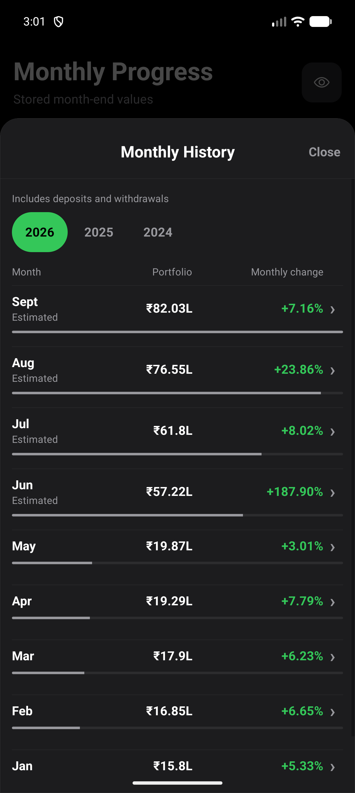
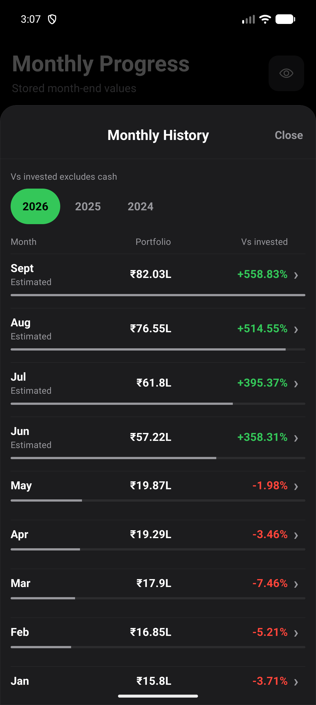
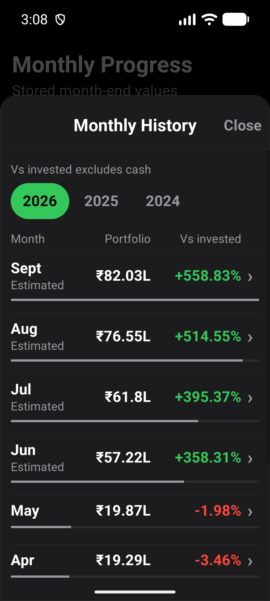
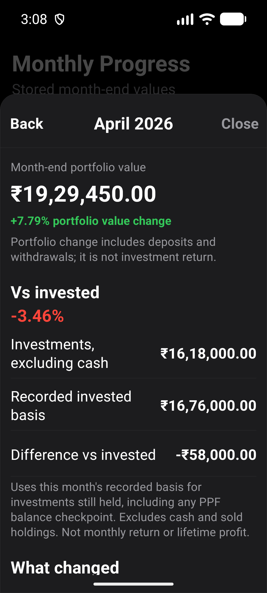
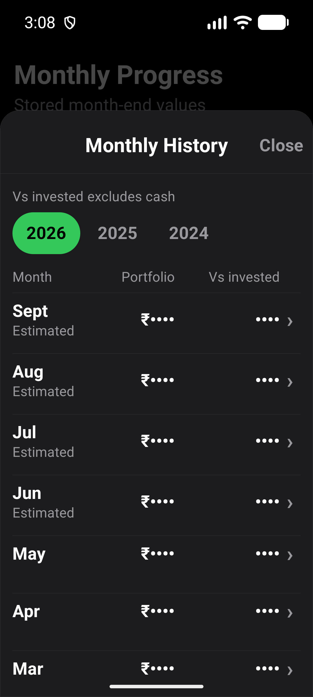

# Monthly History comparison against recorded basis

Issue #490, under #484. Based on main `65658c5`, verified 2 October 2026.

## Approved accounting scope

The initial portfolio-minus-invested proposal would count unused cash as growth.
Inspection found that generated snapshot `portfolioValue` includes cash, while
`investedValue` contains remaining holdings basis plus the PPF invested basis.
The owner approved excluding cash from the comparison before implementation.

The pure selector uses only the selected snapshot:

```
investment value = portfolioValue - cashValue
difference = investment value - investedValue
percentage = difference / investedValue * 100
```

Snapshot validation must pass, invested basis must be positive, and non-cash
investment value must not be negative. Otherwise the comparison is unavailable.
Decimal precision and existing money/percentage rounding apply. No snapshot is
rewritten, no provider is fetched and no migration or reimport is needed.

Holdings basis declines after sales. Sale proceeds and unused contributions in
cash do not increase this comparison. PPF basis starts at its recorded balance
checkpoint, then adds contributions and subtracts withdrawals; it is not a
reconstruction of lifetime deposits. Manual snapshots use their recorded values,
not inferred original purchase costs. Existing corporate-action calculations
remain unchanged. Futures wallet valuation is not added to snapshot scope.

The UI calls this `Vs invested`, explicitly excludes cash and sold holdings,
and does not call it monthly return or lifetime profit. Total portfolio value
and its neutral year-scaled bars still include cash. Detail retains previous
calendar-month comparisons, including cross-year comparisons and unavailable
gaps. Other Progress charts and their calculations are outside this issue.

## Verification

- `npm run test:v1:pc` passed: 187 suites, 1,947 tests; existing one suite and
  three tests skipped. All 17 Expo checks, Android doctor and strict smoke passed.
- Domain tests cover unused cash, deposits/withdrawals, funding a buy, partial
  and full sales, demergers, PPF contributions/interest/withdrawals, decimal
  rounding, invalid records, missing/nonpositive bases and input immutability.
- Component tests cover per-month rather than today's basis, signed and neutral
  values, estimated status, masked text/accessibility/color, unavailable states,
  exact detail values and existing previous-month navigation/comparisons.
- The new test fixtures initially omitted a required PPF financial year and
  used a nonexistent withdrawal-purpose enum. Both were corrected before the
  successful full gate. No production financial behavior changed to suit tests.

## Fresh APK evidence

- Captured the previous APK's Monthly History, then built a fresh x86_64 release
  APK and installed it without clearing existing synthetic data.
- A separate local QA copy uses the emulator's existing debug certificate to
  permit an in-place install. Production signing configuration is unchanged;
  this copy is not a distribution build.
- CogVest_UX_Proof, emulator-5554, API 36, density 480. Normal: 1280x2856, font
  scale 1.0. Larger text: 1080x2400, font scale 1.3. Settings restored afterward.
- `e2e/visual/history-invested-comparison.yaml` passed at both configurations.
  For April 2026 it asserts portfolio INR 1,929,450, non-cash value INR 1,618,000,
  basis INR 1,676,000, difference INR -58,000 and -3.46%. It also asserts the
  separate +7.79% portfolio change and March/April comparison headings.
- The flow checks overview/detail navigation, restored row position, masked
  amounts and comparison percentages, then restores masking off. No financial
  records are written. Screenshots inspected for column alignment, wrapping,
  readable numbers and reachable controls at both sizes.
- Later automatically generated synthetic months have much higher percentages
  than the hand-authored April fixture. Screenshots show stored test data, not
  a claim of real portfolio performance or statement reconciliation.
- Invalid-basis and financial event edge cases were tested in code, not each
  recreated in the native UI. No physical-phone or TalkBack verification claimed.

Original release APK SHA-256:
`BC0A01530AB09B1CBE08325D68A123F192AFFE3096CBB4081E23A05B522A84D9`.

Installed QA copy SHA-256:
`95529D086301E8767AFC0187FE811749D5C7809F9D3B5D29AAFD8BC1F11161E2`.

## Screenshots










