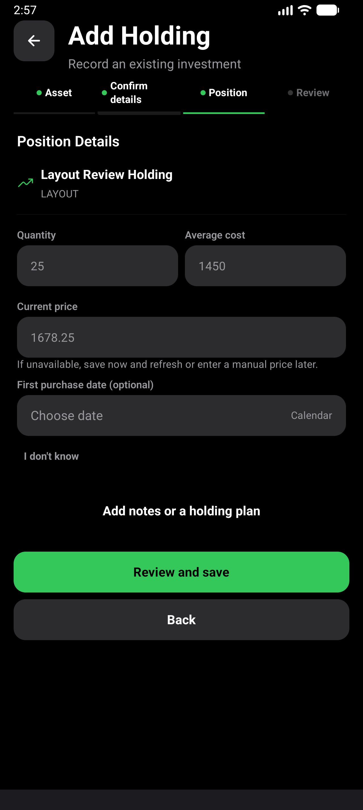
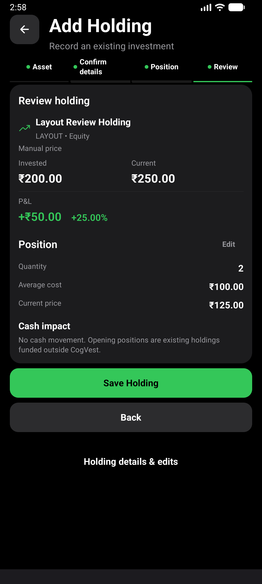
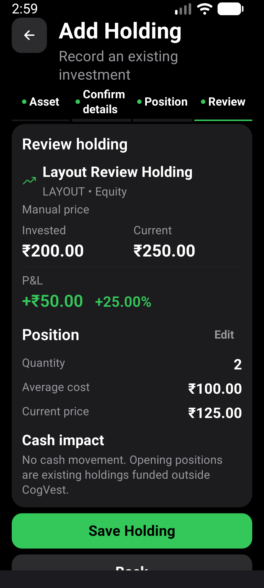

# Add Holding layout verification

Verified 2026-10-02 on `enhance-holding-entry-layout`, based on `52a0361`.

## Environment

- Fresh locally signed release APK, x86_64, installed with `adb install -r`.
- APK SHA-256: `839852AC4A33AA5FF213E98F1A5F4254026CFE8AD6F493CD89D9172D2F7D71CC`.
- AVD `CogVest_Perf`, emulator-5554, API 36, density 480.
- Normal display 1280x2856, font scale 1.0; enlarged-text display 1080x2400,
  font scale 1.3. Both restored afterward.
- Existing synthetic portfolio retained. The visual flow uses an unsaved manual
  draft and stops the app without saving it.

## Results

`npm run test:v1:pc` passed with 185 suites and 1,911 tests, typecheck,
Android doctor and strict package smoke check. One suite and three tests remain
skipped by the existing configuration. The new test covers asset context,
unavailable percentage, grouped P&L values and no persistence before save.
Existing save, validation and Quick Setup tests passed.

`e2e/visual/holding-entry-layout.yaml` passed with `SHOT=normal` and
`SHOT=large-text`. It enters two units at average cost 100 and current price 125,
reaches review with the keyboard docked, and asserts INR 200 invested, INR 250
current value, +INR 50 and +25.00%. Returning to edit retains quantity 2 and
average cost 100. This run verifies draft/review behavior, not a new saved record.

Initial emulator attempts were intercepted by Gboard's stylus tutorial, leaving
the app fields empty. Temporarily setting `stylus_handwriting_enabled` to 0
resolved the input interception. The previously absent secure setting was
deleted after both passing runs. Immediate typed-value assertions prevent this
environmental failure from being mistaken for a successful entry.

Screenshots were inspected for readable fields, selected-asset context,
grouped P&L, preserved no-cash-movement text and edit access. Review remains a
contained confirmation; classification and position entry use open sections.

No physical-phone or TalkBack verification. Calculations, persistence and
navigation contracts are unchanged.
