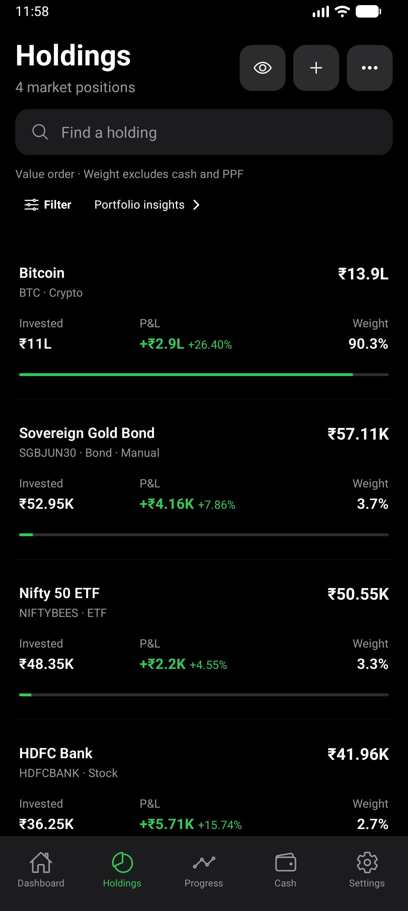
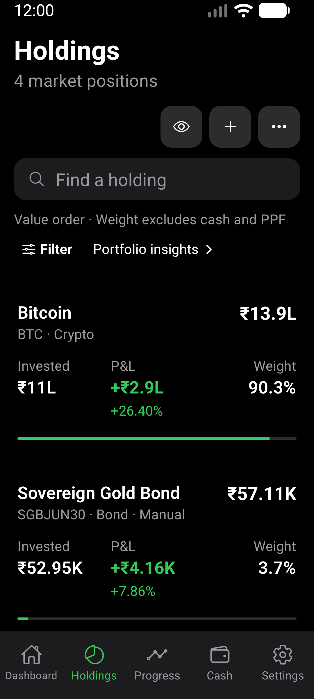

# Holdings refinement verification

Scope: existing market holding rows only. Navigation, financial calculations,
stored records, filters, quote provenance and detail panels are unchanged.

- Current value has stronger size hierarchy; supporting values use tabular digits.
- Signed P&L amounts and percentages retain gain/loss colors.
- Invested value and numeric weight remain visible.
- Each row includes a proportional weight line on a common 0-100% scale.
  Tiny weights are not inflated; unavailable allocations have no line.
- Rows use the root canvas with separators and a visible pressed surface.

## Evidence

Fresh local x86_64 debug APK built from this branch and installed with the existing
private local QA signing identity. Current JavaScript served by Metro.
CogVest_Perf, API 36, density 480; normal 1280x2856/font 1.0 and narrow
1080x2400/font 1.3. Display overrides restored after verification.
Synthetic development seed only; no investor records in these images.

Both images inspected: aligned numeric columns, proportional lines, no visible
overlap. Enlarged P&L wraps its percentage below the amount. Existing header
actions also reflow at enlarged text size.

## Checks and limits

- TypeScript, 185 Jest suites / 1903 tests, Expo doctor 17/17 passed.
  Three tests and one suite remain skipped by the existing configuration.
- Strict Android smoke passed against the new installation.
- Maestro holdings-list-first and holdings-list-first-layout passed, covering
  search, details/back, masking, insights, import navigation, PPF saved balance,
  empty and no-results states.
- Component assertions cover exact amounts, signed P&L styling, proportional
  100% and sub-0.1% weights, absent pending-valuation lines, and long fund identity.
- First native attempt exceeded the dashboard wait during initial Metro bundling;
  the retry passed after bundling completed. No app workaround was introduced.
- This is development-build visual/functional evidence, not standalone release,
  physical-device, TalkBack or frame-performance certification. Long mutual-fund
  names and large portfolios are covered by component tests, not these screenshots.
