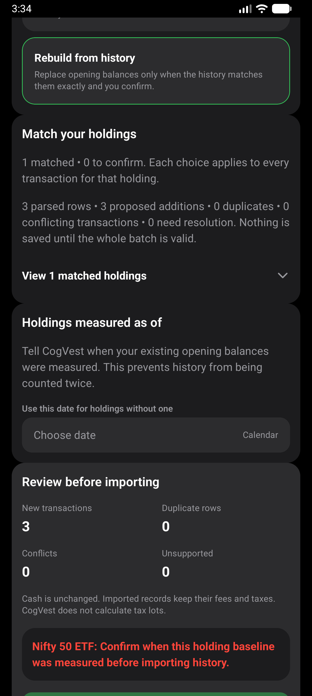
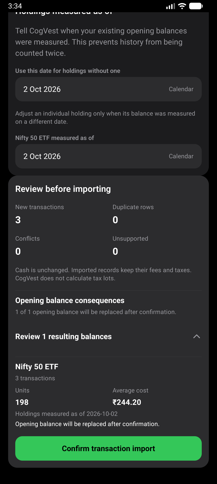
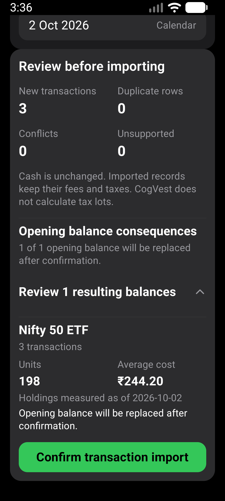

# Import baseline identity fix

Issue #475, verified 2026-10-02. Base: main `aa8ca6a` after PR #476.

## Cause and change

Import reconciliation resolves a selected provider listing to the canonical
local asset. The date-input list previously used the provider ID directly,
so it could omit the opening position required by the plan. Both now use
`assetForResolution`. Canonical matching, date validation, currency validation,
exact reconciliation, confirmation and persistence rules are unchanged.

## Regression evidence

Before the fix, three new hook tests failed because the required local opening
position was absent. After the fix, the focused screen/hook checks passed.
They cover both import modes, saved dates, switching candidates, unrelated
assets, invalid dates, inexact history, unchanged state after cancelling a
preview, committing to the local asset and repeated-import detection.

`npm run test:v1:pc` passed: 186 suites / 1,916 tests passed; one suite /
three tests skipped. All 17 Expo doctor checks, Android doctor and strict
installed-package smoke passed. The first sandboxed run stopped at Expo's
network checks; the rerun with network access passed.

## Fresh APK

Local signed release, x86_64. SHA-256:
`DE4418E3BA905464A2C8E1493D058BE2F27FD260481177927AFC0F27D535372E`.

AVD: CogVest_Perf, emulator-5554, Android API 36, density 480.
Normal display: 1280x2856, font scale 1.0.
Large-text display: 1080x2400, font scale 1.3.

The preview-only `e2e/visual/import-review-layout.yaml` uses the existing
synthetic Nifty 50 ETF opening position and repository CSV in Downloads.
It selects provider candidate `yahoo:NIFTYBEES.NS`, chooses a measurement
date through the native picker, asserts three additions and resulting
198 units at INR 244.20, and checks that confirmation is enabled.
No import is confirmed and no app data is cleared. The repeat run checks
that the date is still unselected after reopening the app.
Both normal and large-text runs passed. Visual inspection found the date
control and reconciled values readable without overlapping text.

Screenshots are synthetic. No physical-phone or TalkBack verification is claimed.
The emulator display and font settings are restored after testing.

