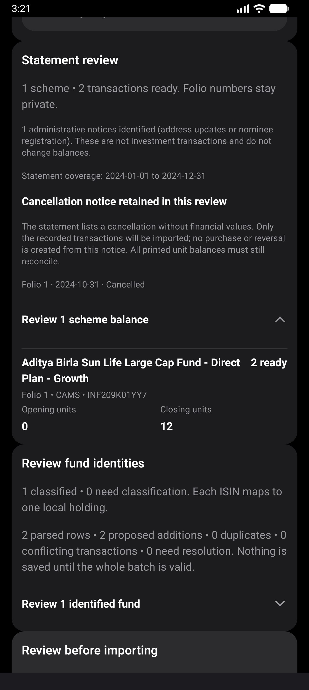
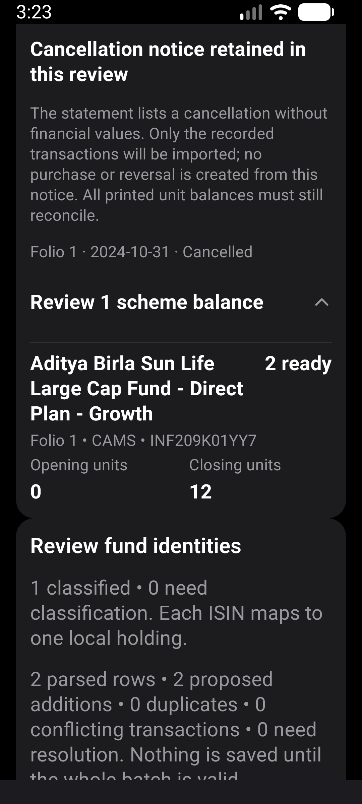
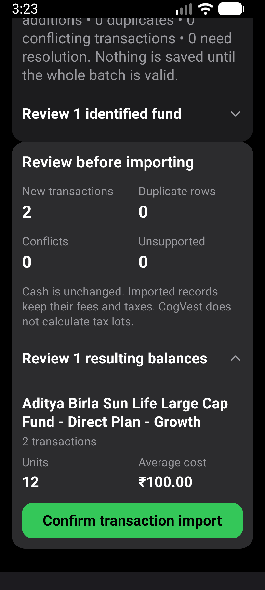
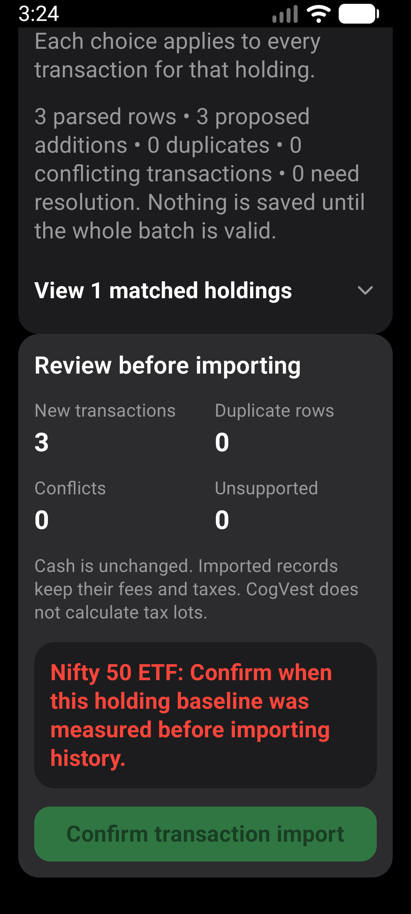

# Import review layout verification

Verified 2026-10-02 on a fresh local x86_64 release APK, based on main
`d5ffd65` with the import-review presentation changes.

APK SHA-256:
`7880204FDAF0FB568E8DDC746B0E1612836409F17D2271BFC00DCDBD8EB521F8`.

## Environment and scope

- AVD: CogVest_Perf, emulator-5554, Android API 36, x86_64.
- Normal: 1280x2856, density 480, font scale 1.0.
- Larger text: 1080x2400, density 480, font scale 1.3.
- Existing synthetic portfolio retained. No app-data reset or import confirmation.
- Inputs: repository `cas-native-synthetic.pdf` and `transactions-import-v1.csv`.
- No private statement, physical-phone or TalkBack verification.

## Checks

`npm run test:v1:pc` passed: 185 suites / 1,911 tests passed, one suite /
three tests skipped. Android doctor and strict installed-package smoke passed.

`e2e/visual/cas-review-layout.yaml` passed the native PDF picker/password,
scheme disclosure and opening 0 / closing 12 unit assertions at normal size.
The larger-text run also expanded resulting balances and asserted 12 units
and INR 100.00 average cost. Both runs stopped without importing.

Screenshot inspection found readable value columns, intact long fund-name
wrapping, visible disclosure chevrons and no overlapping labels or values.
Cancellation notices and reconciliation explanations remain outside disclosures.
Financial calculations, parsing, persistence and confirmation rules are unchanged.

The CSV preview exposed a separate baseline-identity problem, tracked in
[issue #475](https://github.com/abdul-shaikh-dev/CogVest/issues/475).
Selecting the provider candidate for an existing synthetic opening holding
produces a missing-date error without a date input. The visual flow checks
the counts and disabled confirmation; it does not claim a successful CSV import.
That preview-only flow passed at the larger-text configuration.
Earlier attempts to reach resulting CSV balances stopped at this safeguard.

Six existing CAS/Zerodha Maestro flows now assert units and average cost by
separate IDs instead of matching the former prose line. Those full import
flows were not rerun in this presentation pass. Screen tests still cover
confirmation and stored transaction results.

## Evidence

