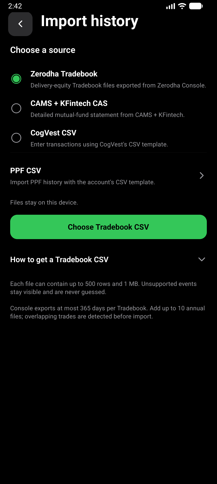
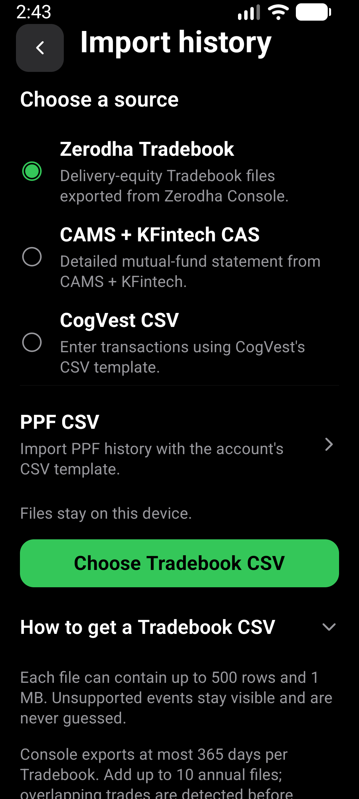
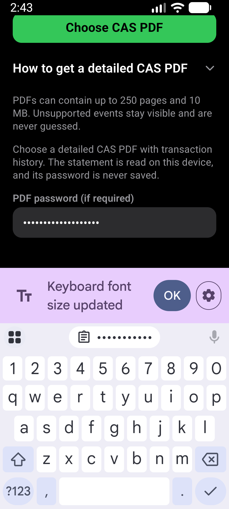

# Import source layout verification

Verified 2026-10-02 on `enhance-import-source-layout`, based on merged Settings
commit `cee5e86`.

## Environment and scope

- Fresh locally signed release APK, x86_64, installed with `adb install -r`.
- APK SHA-256: `AD915CBDB9F60E5DB01B581F93A3C680A5C6009AEE631816FE26C306F31E0A43`.
- AVD `CogVest_Perf`, emulator-5554, Android API 36, density 480.
- Normal display 1280x2856, font scale 1.0; narrower display 1080x2400,
  font scale 1.3. Display settings restored after testing.
- Existing synthetic portfolio retained. Only synthetic password text entered;
  no statement read, import committed, backup written or account created.

## Results

`npm run test:v1:pc` passed: typecheck, 185 suites and 1,910 tests,
Android doctor and strict package smoke check. The existing configuration skipped
one suite and three tests. Tests cover source checked state, PPF navigation,
guidance, password handling and existing import validation/persistence behavior.

`e2e/visual/import-source-layout.yaml` passed with both `SHOT=normal` and
`SHOT=large-text`. It verifies selected source state, expanding/collapsing
Tradebook instructions, access to the CSV template, CAS password visibility
with the keyboard open, and navigation to Add PPF account.

The first visual run opened its deep link before startup settled and remained on
Dashboard. Waiting for Dashboard before opening the link fixed the test timing;
both subsequent runs passed. The initial unit-test query also needed correction
to inspect the non-focusable radio-group container by test ID, while individual
radio controls remain queried by role and name.

Inspected screenshots show readable wrapped descriptions, explicit selection
indicators and a separate PPF destination. The file picker remains the primary
action. Help is a disclosure rather than a competing large button. The CAS
password label and field stay above the docked keyboard, including its enlarged
font notification banner.

No physical-phone or TalkBack verification. This layout check does not repeat
an end-to-end real-statement import. Parsers, matching, review and persistence
were not changed.
