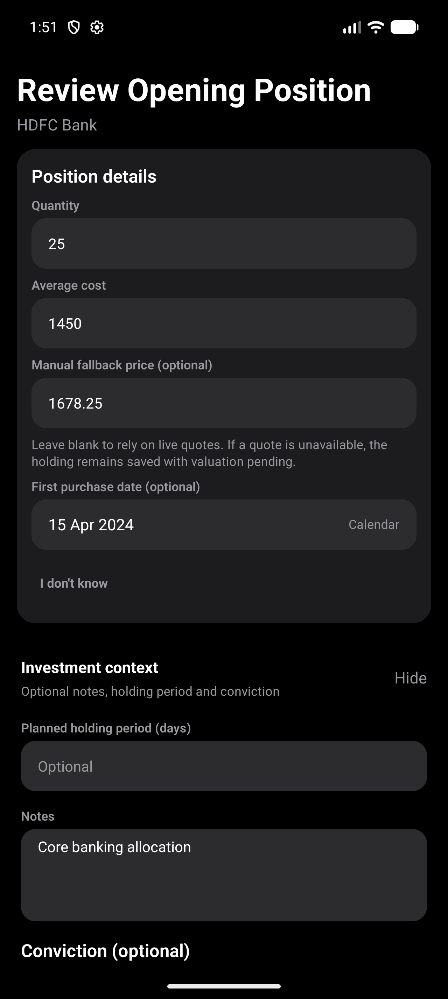
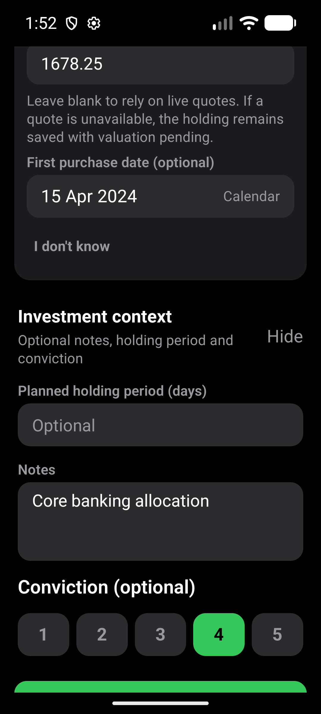
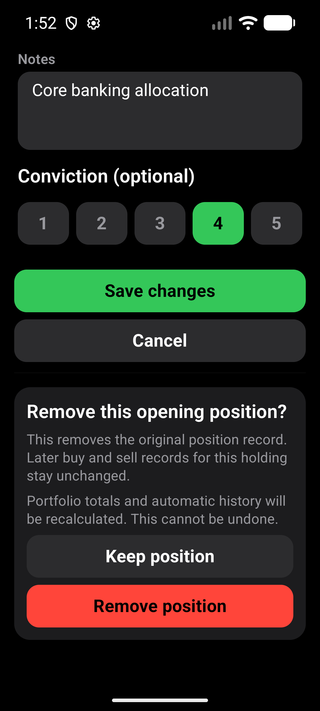

# Opening-position correction layout

Based on main `7fc14b8` after PR #481. Checks run on 2026-10-02.

## Scope

Balance fields stay separate from optional investment context. Existing notes,
holding period or conviction start expanded; empty context starts collapsed.
Hiding context preserves its values, and validation errors reopen it. Save and
Cancel are full-width. Removal has one confirmation with the existing warnings.

Position calculations, manual-price provenance, unknown-date behavior,
persistence and masked-value reveal are unchanged.

## Automated checks

- `npm run test:v1:pc`: 186 suites / 1,921 tests passed; one suite / three tests
  skipped. All 17 Expo checks, Android doctor and strict smoke passed.
- Focused correction screen: 10 tests passed, including hidden-context saving,
  context validation, masking, price provenance, repeated-save/delete guards
  and persistence-failure recovery.
- `npm run android:doctor` passed.

## Native verification

The former CogVest_Perf AVD was unavailable. The existing CogVest_UX_Proof AVD
was started without wiping data. Its previously installed app displayed a
devtools startup error, so no usable before screenshot was captured.

- Built a fresh x86_64 release APK. The AVD's installed package used the standard
  Android debug certificate, so a separate copy of the release-mode APK was
  re-signed with the matching local debug key and installed with `adb install -r`.
  This avoided uninstalling or clearing data. Production signing configuration
  was not changed. The installed copy is for local QA only.
- Device: CogVest_UX_Proof, emulator-5554, API 36, density 480.
- Normal: 1280x2856, font scale 1.0. Larger text: 1080x2400, font scale 1.3.
- Both runs of `e2e/visual/opening-correction-layout.yaml` passed. The existing
  synthetic HDFC position had masking enabled; the flow used temporary reveal
  without changing that preference. It asserted 25 units and the saved note,
  hid/reopened context and reasserted the note, opened removal and chose Keep
  position, then reopened the unchanged 25-unit record.
- Screenshots inspected at both sizes. Context labels wrap without overlap;
  the removal warning and full-width actions remain readable and reachable.
- No position saved or deleted; no app data cleared. Display/font settings
  restored. No physical-phone or TalkBack verification claimed.
- Strict Android smoke passed after installation.

Original release APK SHA-256:
`66A21CBDF656A2DE0B675D1BA35B754772F2F7515AFE03E9F7BF36B2918FD65B`.

Installed local-QA copy SHA-256:
`7A197AE3533B0969D10B5E16CF95609883BAB33EC282459D1424B603DD9B84AB`.

## Evidence

