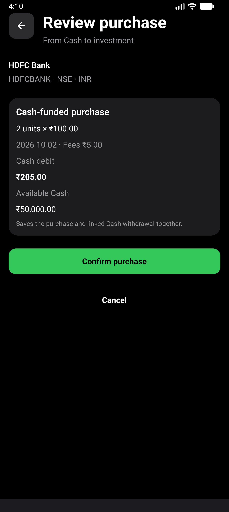
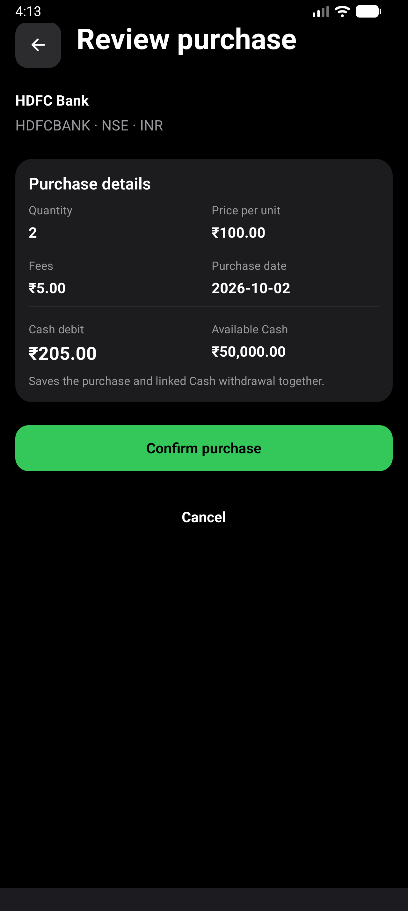
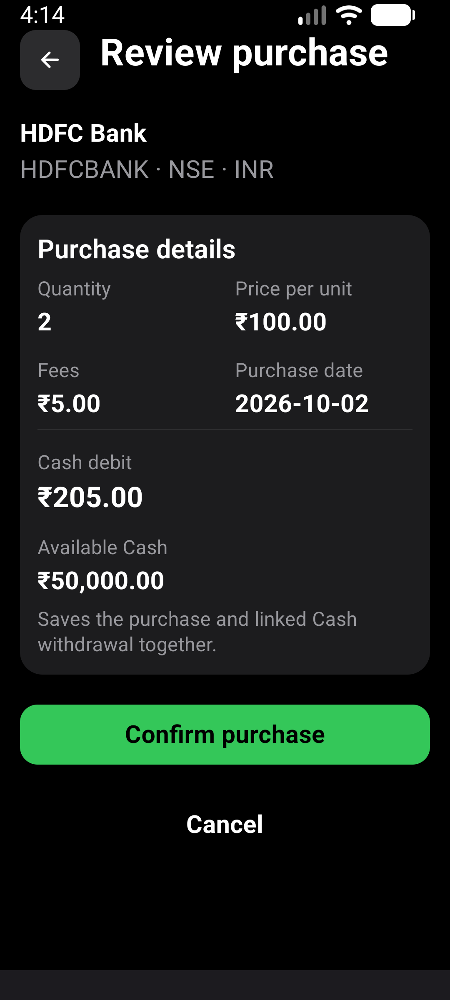

# Purchase review layout

Verified 2026-10-02, based on main `70a8567` after PR #478.

## Scope

Purchase review presents quantity, per-unit price, fees and date as labeled
values. Cash debit and available Cash are grouped below a divider; the debit
has stronger emphasis. Cash values stack at larger font sizes. The review
header no longer repeats the funding description.

Calculations, save behavior, errors, navigation and masking scope are unchanged.
The linked withdrawal explanation and explicit confirmation remain visible.

## Verification

- `npm run test:v1:pc`: 186 suites / 1,917 tests passed; one suite / three
  tests skipped. All 17 Expo checks, Android doctor and strict smoke passed.
- Screen assertions cover the four labeled values, aggregate masking and
  hidden-value accessibility labels. Existing tests cover atomic trade/Cash
  persistence, insufficient funds, persistence failure and draft navigation.
- Fresh locally signed x86_64 release APK, installed without clearing data.
- AVD: CogVest_Perf, emulator-5554, API 36, density 480.
- Normal display: 1280x2856, font scale 1.0.
- Larger text: 1080x2400, font scale 1.3.
- Maestro flow: `e2e/visual/purchase-review-layout.yaml`. Existing synthetic
  HDFC holding; draft of 2 units at INR 100 plus INR 5 fees. Assert INR 205
  cash debit, go Back, check the retained quantity and discard the draft.
  No purchase confirmation or app-data reset.
- Both normal and larger-text runs passed. Screenshots show readable metric
  labels, no overlap and stacked cash figures at 1.3x text.
- Gboard stylus handwriting was temporarily disabled for deterministic input.
  Display, font and handwriting settings are restored after the checks.
- No physical-phone or TalkBack verification is claimed. Masking was checked
  by component tests, not a separate masked native run.

APK SHA-256:
`BCF422C72FF3F112ACB86F3FDC3CE3BC7EE444885F0924B3C727791382A02C34`.

## Evidence

