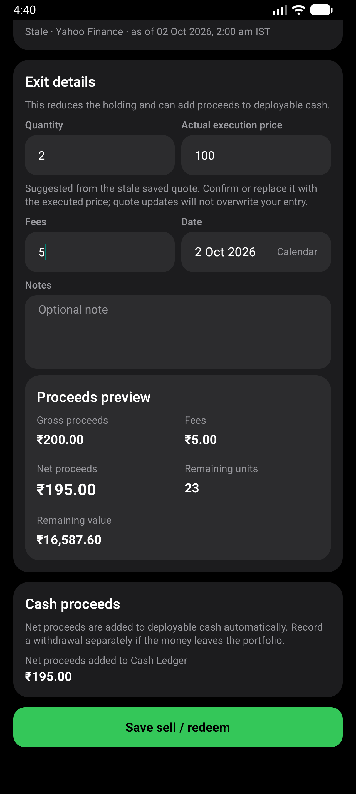
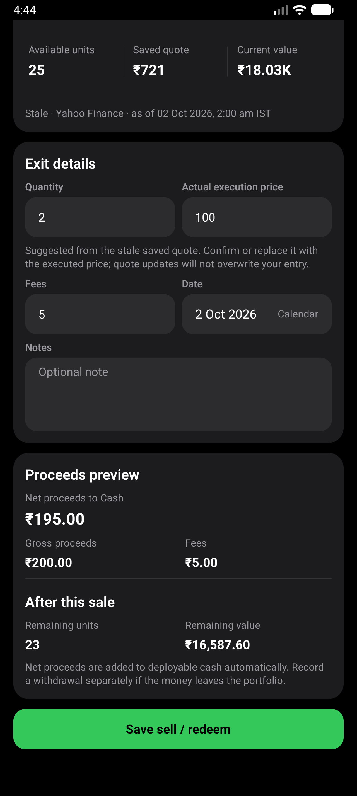
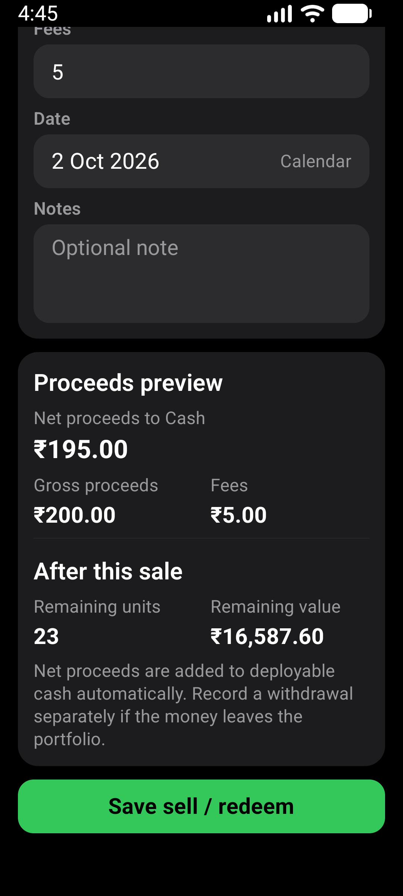
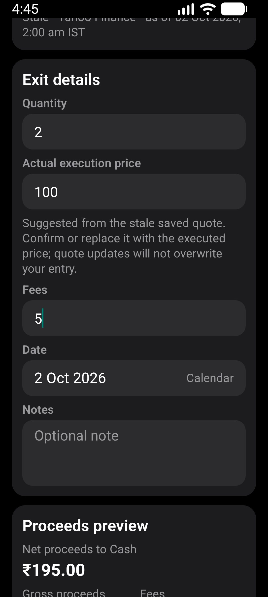

# Sale preview layout

Verified 2026-10-02, based on main `6deb2da` after PR #479.

## Scope

Sell / redeem separates its proceeds preview from the entry form. Net proceeds
to Cash appears once, above gross proceeds and fees. Remaining units and value
sit below a divider under After this sale. Field pairs stack at larger text sizes.

Calculations, persistence, validation, navigation and masking scope are unchanged.
Quote provenance, execution-price guidance and the automatic cash-credit and
separate-withdrawal explanation remain visible.

## Verification

- `npm run test:v1:pc`: 186 suites / 1,917 tests passed; one suite / three tests
  skipped. All 17 Expo checks, Android doctor and strict smoke passed.
- Focused sale screen, hook and calculation tests: 21 passed. Assertions cover
  net proceeds, remaining units/value, linked cash persistence, overselling,
  unavailable quotes, masking and hidden-value accessibility labels.
- Fresh locally signed x86_64 release APK installed without clearing data.
- AVD: CogVest_Perf, emulator-5554, API 36, density 480.
- Normal display: 1280x2856, font scale 1.0.
- Larger text: 1080x2400, font scale 1.3.
- Maestro: `e2e/visual/sale-preview-layout.yaml`. Existing synthetic HDFC holding,
  draft of 2 units at INR 100 with INR 5 fees. Both runs assert INR 195 net
  proceeds and 23 remaining units, return to the quantity field and assert 2,
  then leave without saving. Neither run clears app data or records a sale.
- Before capture used the same draft before the new preview IDs were added to
  the flow. It asserted the net amount and retained input quantity.
- Inspected native screenshots show separate proceeds and remaining-position
  groups, no overlapping labels or figures, and stacked inputs at 1.3x text.
- Display and font settings were restored. Gboard stylus handwriting was
  temporarily disabled for deterministic input, then its prior unset state restored.
- No physical-phone or TalkBack verification is claimed. Masking was checked
  in component tests, not a separate masked native run.

APK SHA-256:
`61888DEBF086AF198CBEC1354821BA5B5688B707A196D0151A0977D66FBF776C`.

## Evidence

