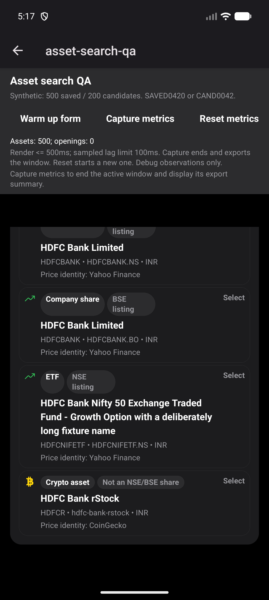
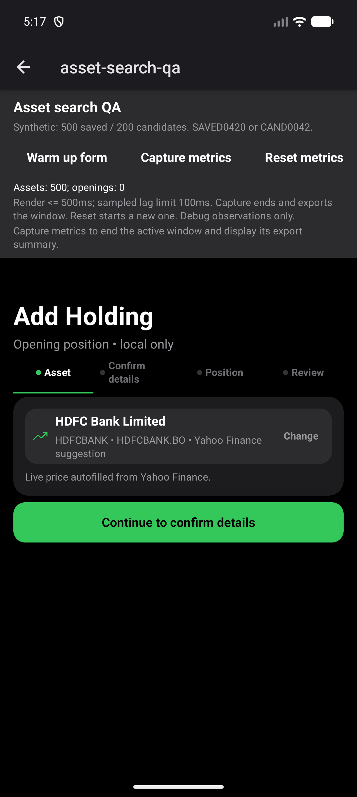
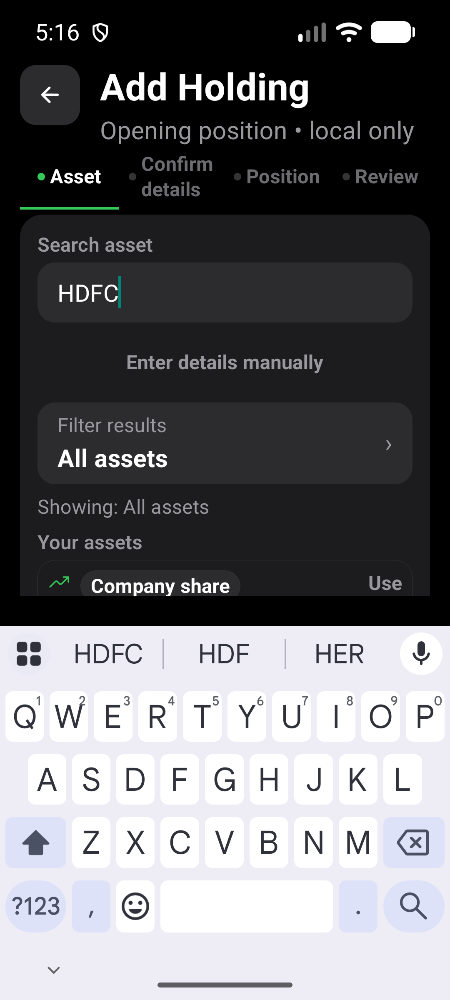

# Search Disambiguation Verification

Issue: #361. Date: 2026-09-19. Scope: UX-12 asset-search identity and recovery.

## Environment

- Pixel 10 Pro, `emulator-5554`, Android API 36.
- Standard pass: 1280 x 2856, density 480, font scale 1.0.
- Narrow large-text pass: 1080 x 2400, density 480, font scale 1.3.
- Fresh local debug APK installed with `adb install -r`; branch JavaScript served
  through Metro. This is not a standalone release-performance or EAS build.
- Search used deterministic QA data for similarly named shares, a mutual fund,
  an ETF, and a crypto asset. No external provider response was required.

## Results

- `npm run test:v1:pc`: typecheck, 164 suites / 1,712 tests, Expo doctor 17/17,
  Android readiness, and strict installed-package smoke passed.
- `e2e/discovery/advanced-search.yaml`: passed the complete search, filter,
  selection, save, pagination, and recent-search regression journey.
- `e2e/discovery/search-disambiguation.yaml`: passed mixed HDFC identity checks,
  no automatic selection or save, and exact BSE identity review.
- `e2e/discovery/search-keyboard.yaml`: passed at 360dp with 130% text. The
  production search field remained above the docked keyboard; Android Back
  opened the unfinished-draft confirmation and Keep editing retained the Asset
  phase.
- Unit tests cover loading, no results, total provider failure with safe retry,
  long names, explicit selection, and unchanged identity metadata.
- The development-only QA screen is not optimized for a 360dp large-text result
  list, so mixed-result visual review used the standard viewport. The production
  Add Holding keyboard and Back behavior used the narrow large-text viewport.
- No physical-phone pass or usability study with people unfamiliar with ticker
  symbols was performed; that remains validation work rather than a code defect.

## Visual Evidence

Results identify instrument type and venue before selection, including an
explicit warning that the crypto candidate is not an NSE/BSE share.

The selected summary retains the exact BSE ticker chosen by the user.

The production search field remains visible above the keyboard at 360dp and
130% text.

