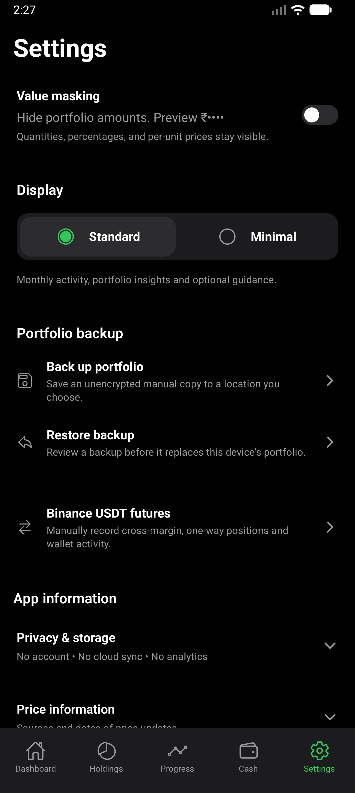
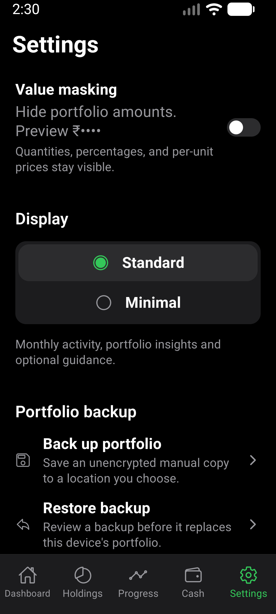
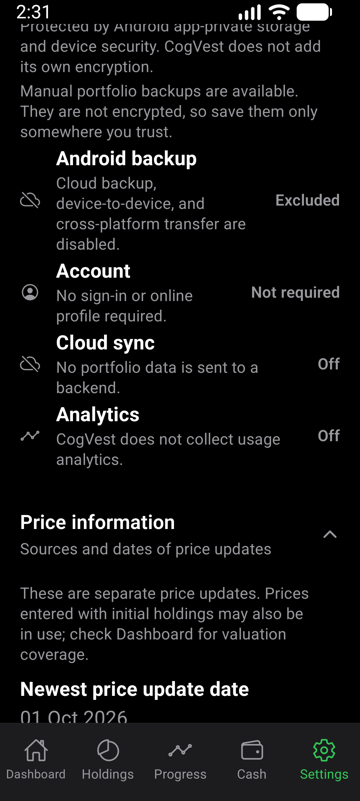

# Settings layout verification

Verified 2026-10-02 on a fresh local release APK built from the Settings changes
on `enhance-settings-layout`, based on `2b18d45`.

## Environment

- AVD `CogVest_Perf`, emulator-5554, Android API 36, x86_64.
- Normal display 1280x2856, density 480, font scale 1.0.
- Narrow/enlarged-text display 1080x2400, density 480, font scale 1.3.
- Locally signed release APK, installed with `adb install -r`.
- APK SHA-256: `5E025500270224D4AD406A791F3E45D65A9FFFE160C99A65EC6DEF7342224D4C`.
- Synthetic portfolio only. No real statements or backup files used.

## Checks

`npm run test:v1:pc` passed, including typecheck, 185 passing suites and
1,909 passing tests, Android doctor and strict installed-package smoke check.
One suite and three tests were skipped by the existing configuration.

`maestro test -e SHOT=normal e2e/visual/settings-layout.yaml` and the same
flow with `SHOT=narrow-large-text` both passed on the new APK. The flow checks
Standard/Minimal selection, masking and Minimal persistence after a cold restart,
masked Dashboard values, both backup destinations, and expanded privacy/price
information. It does not export or restore a backup. Futures routing is covered
by the Settings component test, not the installed-app flow.

Screenshots were inspected for control alignment, wrapping, action hierarchy,
and readable disclosures. The display selector stays horizontal at normal text
and stacks at enlarged text. Backup warnings remain visible on their action rows.
Emulator display and font scale were restored after verification. The synthetic
portfolio finishes in Minimal mode with masking off.

## Evidence

No physical-phone or TalkBack verification was performed. This is a Settings
layout check, not a new validation of backup encryption or restore correctness.
