# Shared UI Hierarchy: UX-15 / #290

Base: `232ac6d`. Branch: `fix/shared-ui-hierarchy`.

## Reassessment And Scope

The original September 5 audit predates the list-first Holdings, focused Add
review, Progress hierarchy and Settings disclosure fixes. Those layouts remain.
This pass uses Impeccable distillation, not another full-screen redesign.

Shared section headings now use 17sp/24sp semibold primary text, below the 30sp
screen title and hero values. Both shared heading components expose header
semantics. Existing focused panel titles, rows and financial values retain their
roles. Body text is not reduced, dimmed or capped to force a layout to fit.

Settings removes the redundant Local only badge; the local-first subtitle and
privacy disclosure retain the meaning. Selected radio rows remain elevated
controls, not a reason to introduce nested informational cards.

Tab labels retain their full names, routes and accessible names. Only tab text
can fit down to 85% within its existing 150% scaling cap; no global scaling cap
was introduced. DESIGN.md records these roles and the navigation compromise.

## Verification

- `npm run test:v1:pc`: passed, 97 suites / 1,009 tests, typecheck, Expo doctor
  17/17, emulator readiness and strict installed-package smoke.
- Focused common components, tab layout, Settings and Maestro inventory: 28/28.
- `npm run android:apk:emulator`: fresh local debug build passed in 24 seconds
  with SDK/Gradle cache access. The first sandbox attempt failed downloading
  Gradle (`Permission denied: getsockopt`); no source change was needed.
- `adb install -r android/app/build/outputs/apk/debug/app-debug.apk`: Success.
  SHA256 `AC6D159045E3AEBDF9EEC43F303D445009109EFBAFCEFD7B8F4AB3C2FF2A2F7A`.
  This native-shell hash is unchanged by JS-only changes. Current branch Metro
  supplies JS over `adb reverse tcp:8081 tcp:8081`; this is not standalone release
  certification. The existing project Metro listener was reused, not duplicated.
- Normal-size Maestro: shared hierarchy, Add Holding review/edit/save, Settings
  preference persistence/masking/Minimal mode, and privacy disclosures passed.
  Add save verifies quantity 2, invested INR 200, current INR 250 and no cash entry.
- Shared hierarchy and the complete Add review/edit/save journey also passed at
  360dp / 130% text. Screenshots show the complete Dashboard tab name, wrapping
  headings and scroll-reachable save controls.
- A targeted 360dp / 150% Settings-to-Dashboard navigation check passed; both
  active and inactive full tab labels were visually inspected. Original display
  size and font scale 1.0 were restored and confirmed afterward.

## Repeatable Native Check

Use the freshly installed local debug APK and a responsive project Metro server.
All journeys reset only the emulator's synthetic developer portfolio.

```powershell
npm run maestro:test -- e2e/shared-ui-hierarchy.yaml e2e/add-holding-review-hierarchy.yaml e2e/settings-preference-hierarchy.yaml e2e/privacy-settings.yaml
```

Repeat shared hierarchy and Add review at 360dp / 130% text. On this 480dpi
Pixel_10_Pro, use `adb shell wm size 1080x2410` and
`adb shell settings put system font_scale 1.3`. Check the tab bar again at 150%.
Restore original 1280x2856/default size and font scale 1.0 after testing.

## Browser Capability Check

Chrome was requested explicitly. The browser inventory exposed only Codex's
in-app browser; opening Chrome returned `Browser is not available: chrome`.
No Chrome visual result is claimed. Native verification was not replaced by HTML.

## Evidence

Original, unedited emulator images under `artifacts/shared-ui-hierarchy/`.

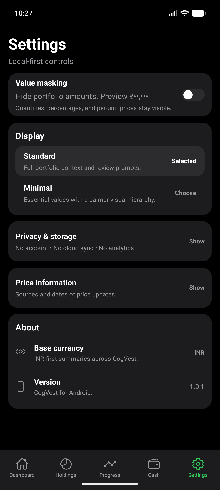
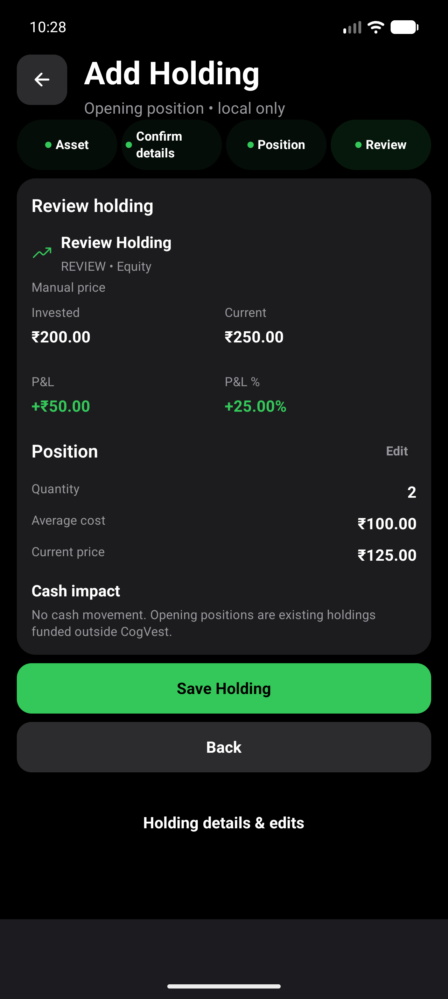
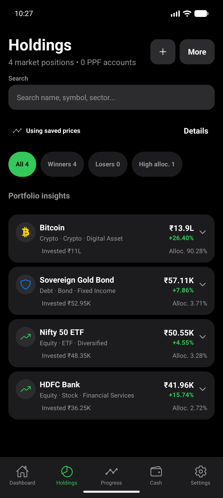
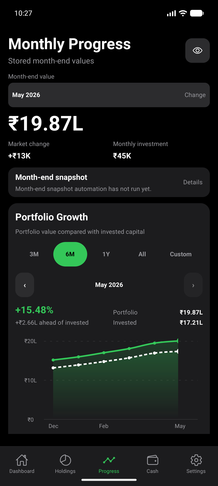
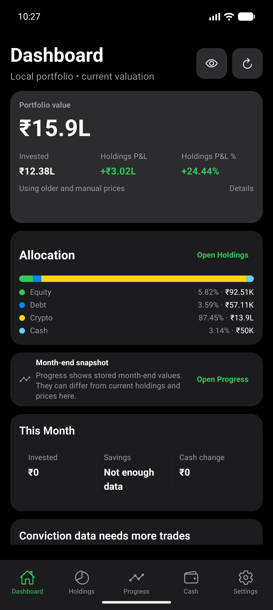
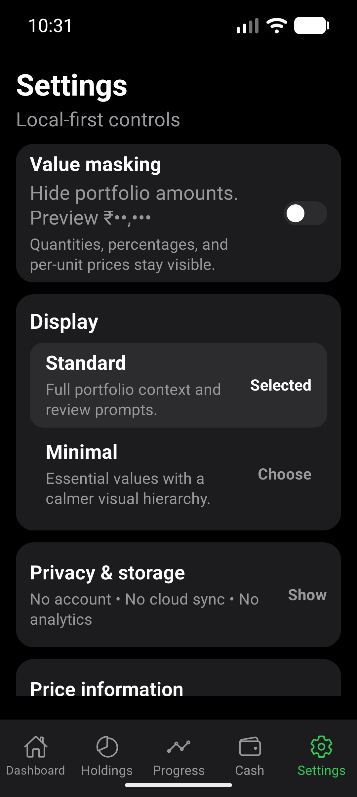
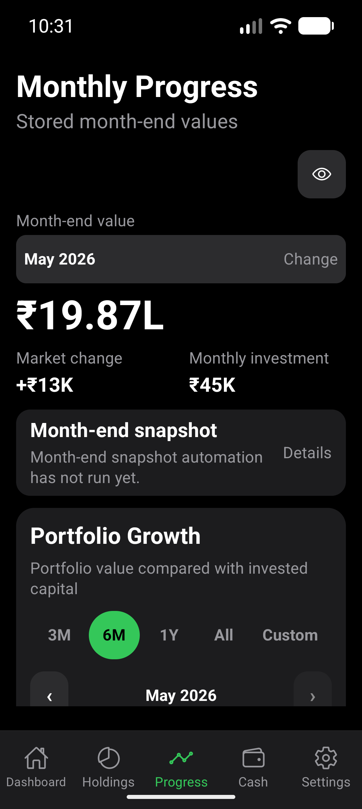
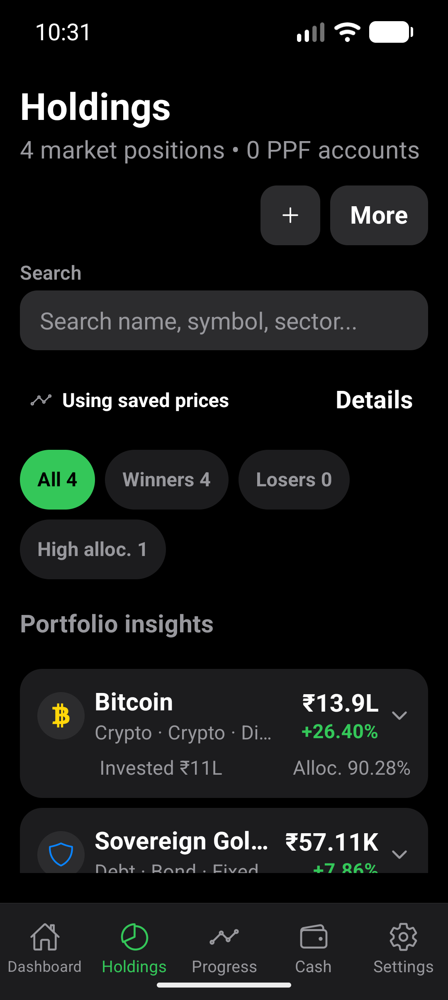
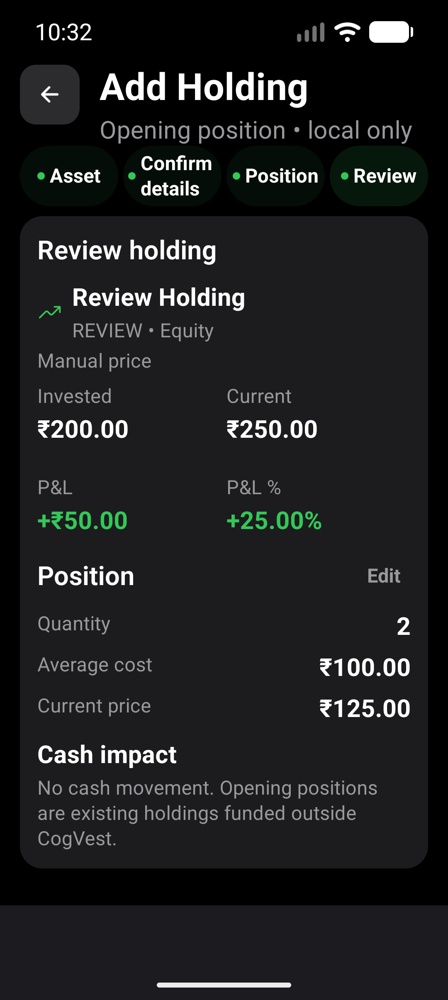
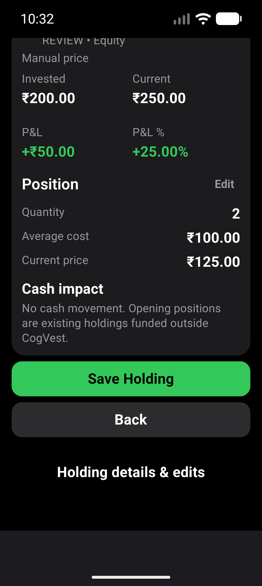
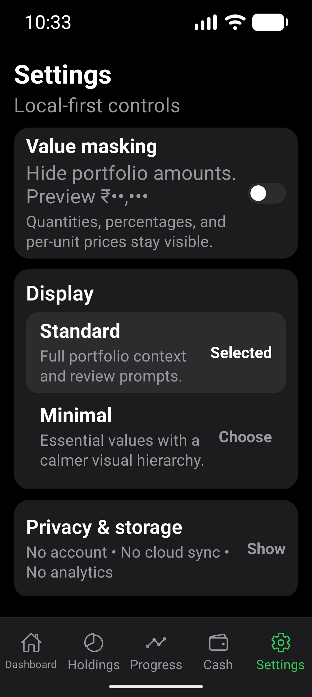
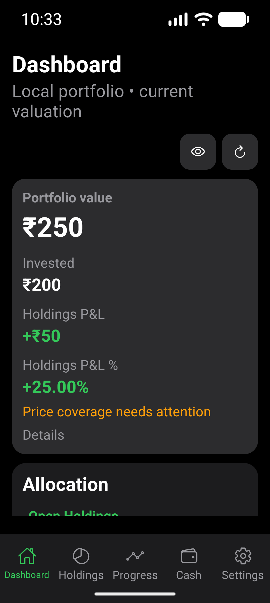

Compact holding rows retain their existing ellipsis for long names/metadata;
full information remains in expanded details. Larger text requires more scrolling.
This pass does not claim every supported text scale or a TalkBack session was
tested; heading roles were verified with component tests.

No financial, persistence, provider, chart-interaction or navigation contract
changed. No EAS build, dependency addition or historical audit edit.
