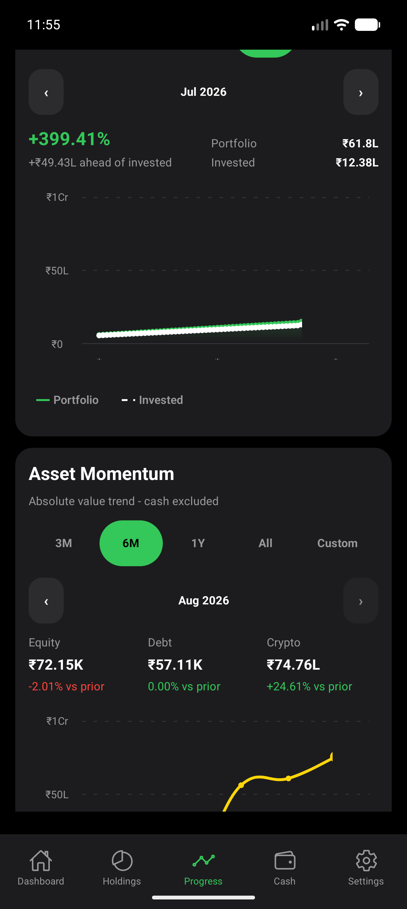
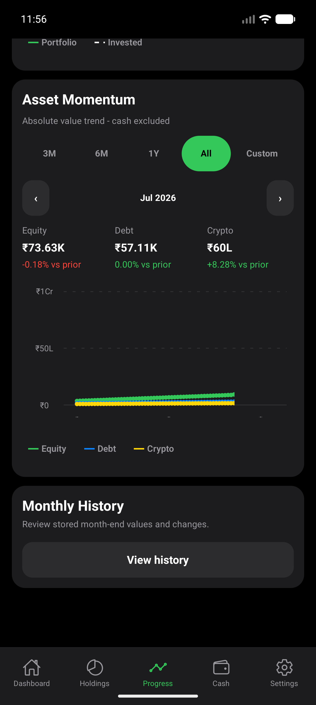

# Standalone Chart Verification

Run: 6-7 September 2026. Base: `4678980` (merged PR #293).

## Verdict

Standalone launch and the scoped functional regression passed. Long-history
visual correctness and smoothness did **not** pass. Do not call the UX audit
fully closed based on the passing Maestro or component assertions.

No production UI/domain calculations were changed in this pass. Changes add an
optional development fixture, opt-in release journeys, and evidence.

## Build And Data Identity

- Pixel_10_Pro, emulator-5554, 1280x2856, density 480, font scale 1.0.
- Local x86_64 release APK, version 1.0.1 / versionCode 2. Emulator-only QA;
  not an externally distributed build or production signing identity.
- SHA-256: `5EA7435DC58DDBE2CCAF64AD0671C4D9B51B5555EC5A76A977DFEA011DA347CD`.
- Built with `npm run android:apk:release -- --architecture=x86_64`.
  Signature verification passed; Android rejected `run-as` as not debuggable.
- Owner approved a new private local QA key. The PKCS12 key and Windows
  DPAPI-protected password live outside the repository in
  `%USERPROFILE%/.cogvest-local-qa/`. No production credentials were changed,
  downloaded, logged, or committed. No EAS build or tag push occurred.
- Emulator initially had no installed CogVest package. A separate copy of the
  existing debug APK was signed with this QA key and used with current Metro JS
  to prepare synthetic data. It was upgraded with `adb install -r` to the fresh
  same-key release without uninstall/reset.
- Fixture: 60 consecutive stored months, June 2021-May 2026. On release launch,
  normal automation generated June-August 2026, resulting in 63 months. Those
  generated values reflect synthetic holdings and real provider behavior, not
  a real investor's portfolio or a reproducible live-price fixture.
- Metro listeners on 8081 and 8082 were stopped and reverse forwarding removed
  before the release tests. Launch/reopen succeeded without Metro. The release
  seed URL displayed `visual-qa-seed-blocked` even with the known token and
  `history=long`.

The installed emulator APK now uses the private QA certificate. A default
debug-key APK cannot update it directly. Re-sign a development copy with the QA
key for retention testing, or explicitly approve removal of the synthetic QA
installation. Never uninstall a real user's data to solve a signature mismatch.

## Functional Results

| Check | Result |
| --- | --- |
| Standalone Dashboard cold launch and stop/reopen | Pass |
| Release destructive seed route remains blocked | Pass |
| 3M, 6M, 1Y, All range activation and latest selection reset | Pass |
| Portfolio and asset previous-month selection | Pass |
| Vertical plot swipes retain the inspected month | Pass |
| Custom March-May 2026 range | Pass: May value 19.87L, +15.48% |
| End picker excludes dates before selected start | Pass for tested February boundary |
| Monthly History, May 2026 detail | Pass: retained 19.87L |
| Older year 2021, June detail, Back to list/Progress | Pass: retained 5.3L |
| Holdings, Cash, Settings routes | Pass: screen assertions |
| Typecheck, Jest, Expo doctor, strict PC gate | Pass: 97 suites / 1015 tests, doctor 17/17 |

This is not full import/onboarding/transaction verification, a live-provider
accuracy audit, TalkBack certification, or exhaustive empty/Minimal-state QA.

The first native assertion expected May as latest and failed after legitimate
release automation added three months. Corrected the test to accept explicitly
supplied observed month labels, not arbitrary text; historical data assertions
still verify exact known values. The first Jest gate found the new release flow
in the default development-flow inventory. Moved it under `e2e/standalone/`;
the final gate passed. Neither failure is a production regression.

## Confirmed Visual Finding: Long History Is Truncated

Both charts in All mode omit later plotted points and collapse x-axis labels
to ellipses. The July selected summary is far above the line endpoint visible
in the chart. This persists after month changes, scrolling, and settled frames;
it is not just a capture of the initial animation.




Source inspection target: `TrendChart`, `getChartSpacing`, and
`toGiftedChartData` in `src/features/progress/ProgressScreen.tsx`, including the
interaction between Gifted Charts width, clipping, animation, and label cells.
The exact root cause has not been established; do not blame the library or
change financial series data to conceal clipping.

Follow-up acceptance:

- Show first, middle, and last data points inside both plots at 3, 12, 60, and
  120 months, including a large latest-month value to expose clipping.
- Keep sparse month labels legible; include year context across multiple years.
- Selected-month marker and summary must refer to the same visible data point.
- Verify narrow Android widths and enlarged text on a freshly built release.
- Preserve independent ranges, cash exclusion, masking, and scroll isolation.

## Performance Finding: Frame Budget Misses Need Investigation

With compilation, Jest, Metro, and Maestro finished, ran the captured
[probe script](artifacts/2026-09-07-standalone/standalone-perf.ps1).
It uses measured control coordinates, not portable screen assumptions.
Each range sample switches 3M/6M/1Y/All three times with 700ms pauses. Each scroll
sample performs six up/down pairs, 450ms gestures with 350ms pauses. Reset
`dumpsys gfxinfo` before each sample and retained raw framestats.

The first aggregate block of each file reports:

| Probe | Frames | Janky frames | P95 |
| --- | ---: | ---: | ---: |
| Range 1 | 262 | 213 / 81.30% | 65ms |
| Range 2 | 251 | 209 / 83.27% | 57ms |
| Range 3 | 252 | 201 / 79.76% | 53ms |
| Scroll 1 | 335 | 275 / 82.09% | 65ms |
| Scroll 2 | 340 | 298 / 87.65% | 69ms |
| Scroll 3 | 344 | 307 / 89.24% | 69ms |

Raw `standalone-range-*.txt` and `standalone-scroll-*.txt` files are in the same
artifact directory. Aggregate and per-window counters can differ by a frame
while the diagnostic is being collected; they are not separate samples.

Three `am start -W -S` cold launches reported TotalTime 491, 497, and 771ms.
These are ActivityManager timings, not time-to-interactive or a product SLA.
One post-probe memory sample reported PSS 150066KB and RSS 274236KB; a single
sample cannot establish a leak. Exit history showed requested force stops for
the tested process runs, not an observed crash/ANR.

Limits: this is one high-resolution emulator and host, not a physical-phone
benchmark or a controlled before/after optimization experiment. The pipeline
reported Skia/OpenGL. GPU histogram overflow buckets (4950ms) are not credible
GPU-latency measurements here and are excluded. No JS/UI/GPU trace attribution
was collected. High frame misses are a follow-up signal, not proof that Gifted
Charts alone is responsible.

Next: reproduce with a controlled host load, capture a release/profileable trace,
separate chart rerender/animation work from emulator rendering cost, and compare
the same dataset and gestures before/after any fix. Do not add blanket memoization
or switch chart libraries without evidence.

Method references: [Android dumpsys](https://developer.android.com/tools/dumpsys)
and [React Native release-mode performance guidance](https://reactnative.dev/docs/performance).

## Repeatable Opt-In Journeys

Prepare the development-only `history=long` fixture with explicit confirmation,
then install the same-key release. Do not clear app state in these flows.
Inspect the latest stored months because real automation can advance them.

```powershell
maestro test -e "LATEST_MONTH=Aug 2026" -e "PREVIOUS_MONTH=Jul 2026" `
  e2e/standalone/chart-regression.yaml
npm run maestro:test -- e2e/standalone/custom-range.yaml
```

These tests do not belong in default PR emulator checks. The numeric latest-month
values are deliberately not fixed to live provider responses. Historical May
and June 2021 assertions remain exact.

Accessibility remained off (`null` services, enabled=0); font scale, dimensions,
and density were unchanged. Synthetic data and the standalone QA APK were left
installed for further inspection. Metro was left stopped intentionally.
