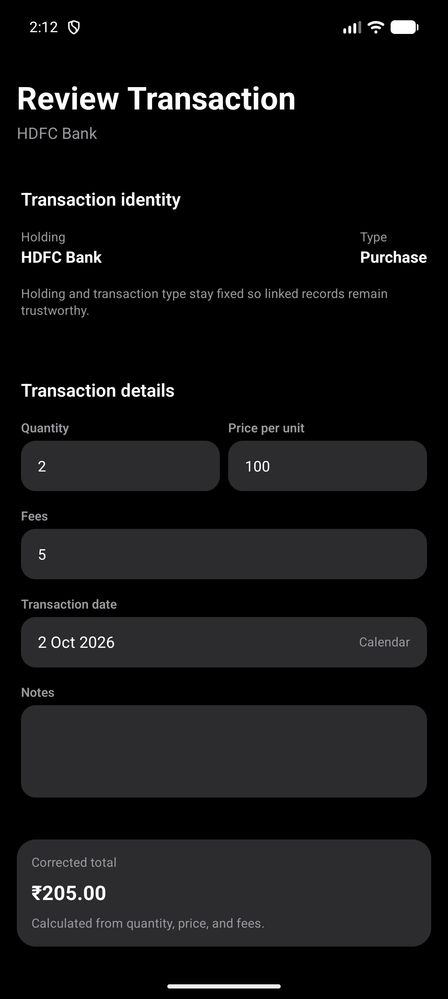
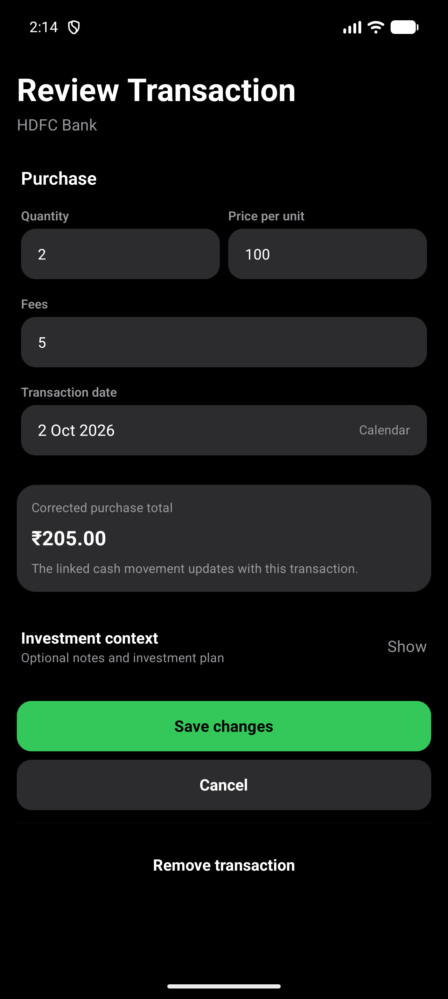
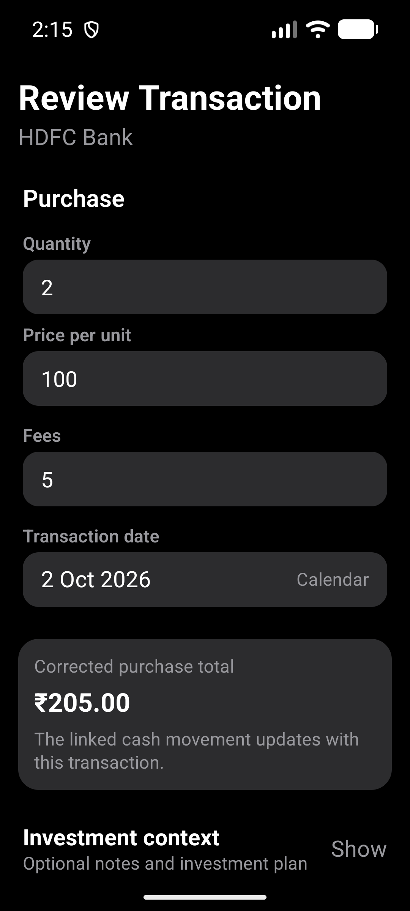
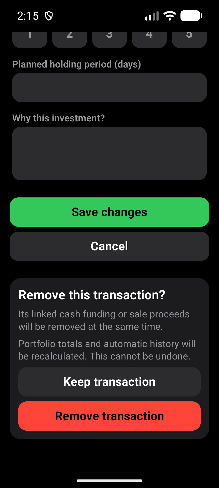

# Transaction correction layout

Based on main `3df1975` after PR #482. Verified on 2026-10-02.

## Scope

The holding name appears once. Purchase or Sale heads the financial fields;
the corrected total includes linked-cash context. Optional notes and investment
context start collapsed when empty and expanded when already populated.
Collapsing preserves drafts; validation reopens invalid context. Save and Cancel
are full-width, with removal behind a separate confirmation.

Financial calculations, persistence, linked-cash updates and read-only imported
transfer behavior are unchanged.

## Automated checks

- `npm run test:v1:pc`: 186 suites and 1,923 tests passed; one suite and three
  tests skipped. All 17 Expo checks, Android doctor and strict smoke passed.
- Ten focused transaction-editor tests passed, including optional-context draft
  preservation, hidden validation errors, linked-cash corrections and deletion,
  masking, stale records and persistence failure.
- The first full gate could not reach Expo metadata services from the sandbox.
  The rerun with network access passed.

## Installed-app verification

- Fresh x86_64 release-mode build, installed over the existing synthetic
  portfolio without clearing data. As in #482, a separate local QA copy was
  signed with the emulator's existing debug certificate so installation did not
  require an uninstall. Production signing configuration was not changed.
- CogVest_UX_Proof, emulator-5554, API 36, density 480.
- Normal display: 1280x2856, font scale 1.0. Large text: 1080x2400, font scale 1.3.
- Captured the previous APK's editor before installing this build.
- Created one synthetic HDFC purchase through the app: two units at INR 100,
  INR 5 fees, total INR 205. The existing HDFC transaction list was empty first.
- `e2e/visual/transaction-correction-layout.yaml` passed at both sizes. It asserts
  quantity, price and total; edits a note; hides and reopens context; asserts the
  draft survives; opens removal and chooses Keep; cancels editing and verifies
  the transaction still has two units and no saved draft note.
- Inspected normal and large-text screenshots. Inputs stack at large text;
  labels, totals, confirmation warnings and actions remain readable.
- The paired cleanup flow removed only this synthetic purchase. It asserted
  cash changed from INR 49,795 back to INR 50,000, the transaction list was empty,
  and the original opening position still held 25 units.
- No original record edited or removed. Value masking was already off and was
  not changed. Native sale editing, physical-phone and TalkBack checks were not
  performed. Display, font and temporary handwriting settings restored.

Original release APK SHA-256:
`D3120CA82B4791AFB4A71016DF245745581CACCF5375BBE8D7B50F6E344E4800`.

Installed local-QA copy SHA-256:
`D27005E53F8E911368E814F18BA34291716A9D4C3E584611919D5A378010DC25`.

## Screenshots

