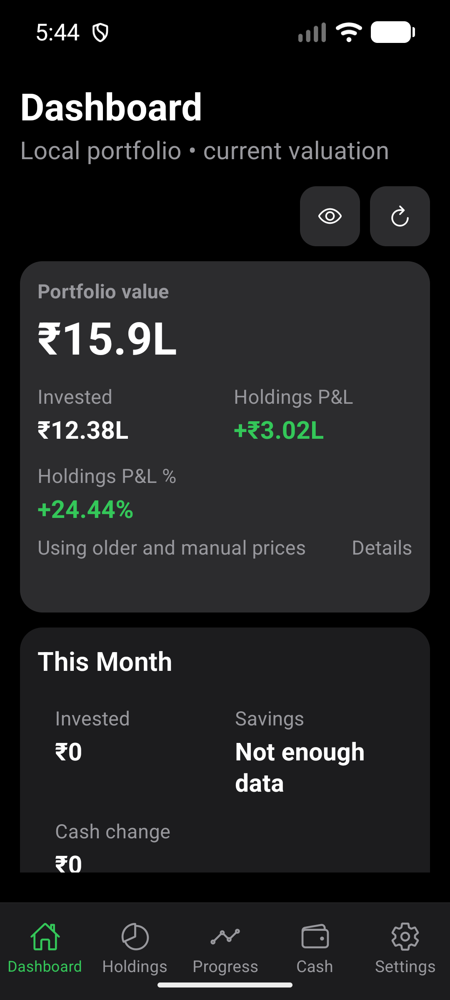
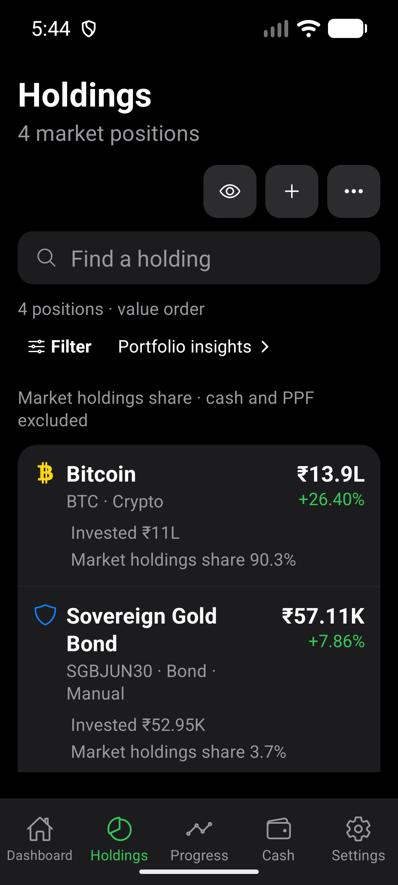
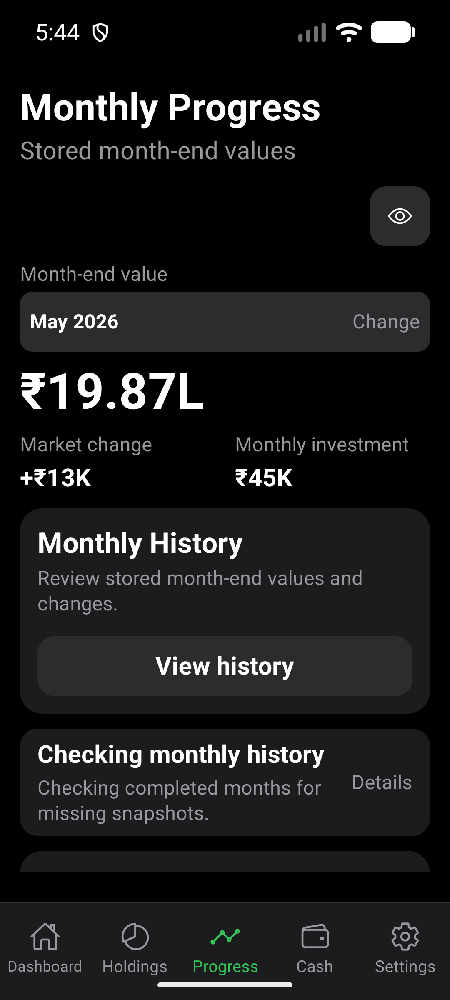
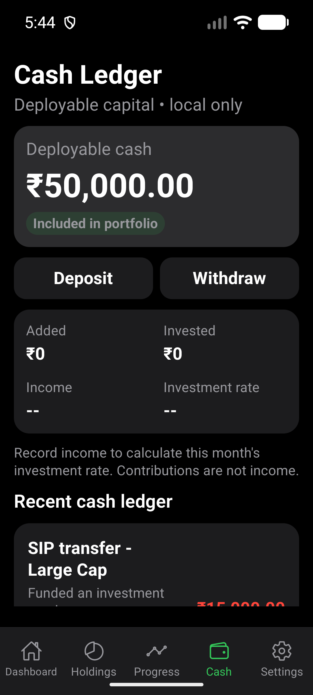
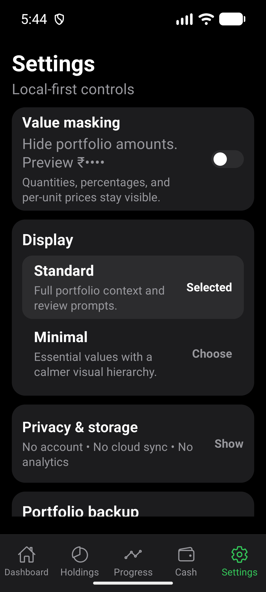
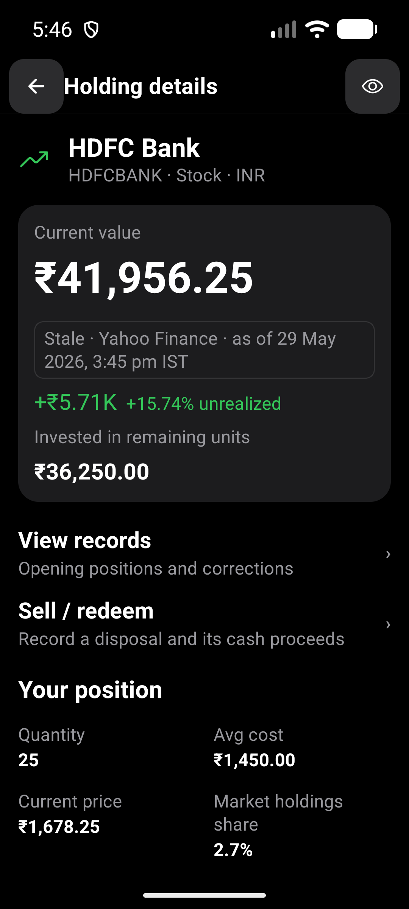

# September 2026 UX Audit Closeout

Issue: #350. Date: 2026-09-19. Base: `b6f0707`.

## Resolved Findings

Every child issue is closed by a merged pull request:

| Finding | Issue | Pull request |
| --- | --- | --- |
| Guided source-based onboarding | #348 | #380 |
| Recoverable snapshot status | #351 | #370 |
| Inline PPF validation | #352 | #381 |
| Holding return context | #353 | #382 |
| Quote freshness at the decision point | #354 | #384 |
| Screen-level content hierarchy | #355 | #387 |
| Progress chart control hierarchy | #356 | #391 |
| Long-history chart signal | #357 | #393 |
| Scalable month-range selection | #358 | #392 |
| Android minimum touch targets | #359 | #383 |
| Financial scope and comparison labels | #360 | #390 |
| Search instrument disambiguation | #361 | #394 |
| Form wording and progressive disclosure | #362 | #388 |
| Compact masking and Minimal scope | #363 | #389 |

The child issues and their evidence records remain the authority for each local
acceptance contract. This pass verifies that their merged behavior coexists
across screens; it does not replace those focused records.

## Environment

- Pixel 10 Pro AVD, Android API 36, `emulator-5554`.
- Normal pass: 1280 x 2856, density 480, font scale 1.0.
- Large-text pass: 1080 x 2400 (360dp), density 480, font scale 1.3.
- Fresh local debug APK built from merged `main` and installed with
  `adb install -r`. Current JavaScript was served through Metro.
- Synthetic visual-QA data only; no private portfolio data was used.
- The emulator was restored to 1280 x 2856 and font scale 1.0 after testing.

## Cross-Screen Results

- `e2e/shared-ui-hierarchy.yaml` passed at normal size and 360dp / 130% text.
  Dashboard, Holdings, Progress, Cash, and Settings remained reachable with
  their complete tab labels, primary actions, and approved hierarchy.
- `e2e/workflow-exit-navigation.yaml` passed at both sizes. Add Holding exits to
  its originating Holdings screen, while Sell / redeem Back restores the same
  HDFC Bank detail context. The journey still expected the pre-#353 list return;
  its assertion was corrected to the approved detail-return contract.
- `e2e/dashboard-valuation-basis.yaml` passed. Current valuation, Holdings P&L,
  price limitations, allocation scope, exact-value disclosure, and stored
  month-end Progress context remained distinct.
- `e2e/value-masking.yaml` passed through save, mask, detail, restart, and
  persistence. Portfolio amounts were masked while quantity and percentage
  remained visible as disclosed in Settings.
- Original-resolution screenshots and Android UI hierarchy bounds confirmed all
  five tabs occupy equal 216px targets at 360dp / 130% text. Resized image
  previews briefly appeared cropped during review; the source PNGs and native
  hierarchy were complete, so no app defect was recorded.
- No duplicate UX scope or uncovered child acceptance criterion was found. The
  adjacent import-correction tracker #338, chart-attribution issue #299, and
  parked roadmap items remain independent.

## Visual Evidence

The stable large-text screens preserve primary information and complete tab
navigation. More content requires scrolling, as expected.

Sell / redeem returns to the originating holding detail rather than losing the
user's context.

## Limits

This is installed-emulator verification, not physical-phone or release-build
certification. No TalkBack session, new user study, or every supported Android
font/display combination was tested. Existing child records state their own
additional limits. No financial formula, persistence schema, provider contract,
or production data changed in this closeout.
